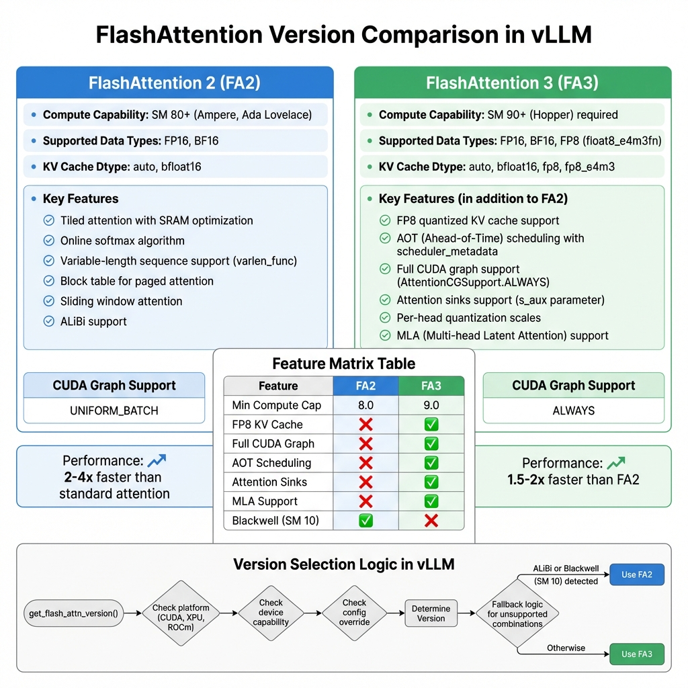
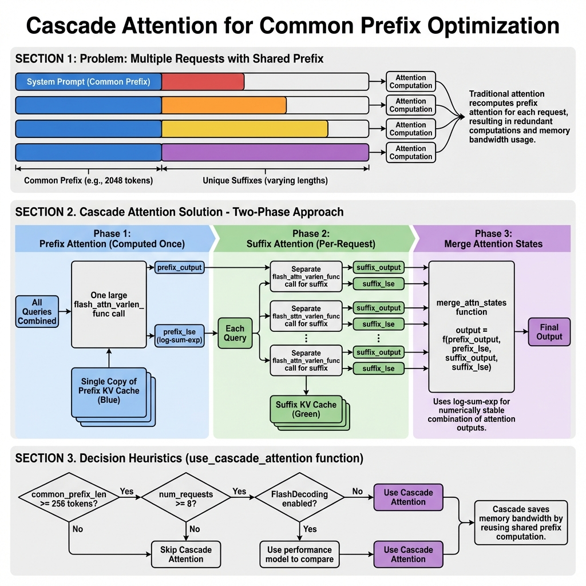

> 本文档深入分析 vLLM 中 FlashAttention 的实现原理、架构设计和优化技术。

## 目录

1. [FlashAttention 概述](#flashattention-概述)
2. [架构设计](#架构设计)
3. [内存I/O优化原理](#内存io优化原理)
4. [FlashAttention 版本对比](#flashattention-版本对比)
5. [核心实现代码分析](#核心实现代码分析)
6. [Cascade Attention 机制](#cascade-attention-机制)
7. [CUDA Graph 支持](#cuda-graph-支持)
8. [集成与扩展](#集成与扩展)
9. [性能对比与最佳实践](#性能对比与最佳实践)

---

## FlashAttention 概述

### 什么是 FlashAttention？

FlashAttention 是一种高效的注意力机制实现，通过优化内存访问模式来显著提升 Transformer 模型的推理性能。它的核心创新在于：

1. **内存I/O优化**：减少 GPU HBM（高带宽内存）访问次数
2. **分块计算（Tiling）**：在 GPU SRAM 中进行计算
3. **在线 Softmax**：允许分块计算 attention 而不需要完整的注意力矩阵
4. **融合内核**：将多个操作融合到单个 CUDA 内核中

### 在 vLLM 中的角色

在 vLLM V1 架构中，FlashAttention 作为核心 Attention Backend 之一，负责高效执行自注意力计算。它与 PagedAttention 协同工作，支持 KV Cache 的分页管理。


---

## 架构设计

### 类结构概览

vLLM 中的 FlashAttention 实现由以下核心类组成：

```
vllm/v1/attention/backends/flash_attn.py
├── FlashAttentionBackend     # 后端定义类
├── FlashAttentionMetadata    # 注意力元数据
├── FlashAttentionMetadataBuilder  # 元数据构建器
└── FlashAttentionImpl        # 注意力实现
```

### FlashAttentionBackend

`FlashAttentionBackend` 是 FlashAttention 后端的入口类，定义了后端的能力和配置：

```python
class FlashAttentionBackend(AttentionBackend):
    accept_output_buffer: bool = True
    supported_dtypes: ClassVar[list[torch.dtype]] = [torch.float16, torch.bfloat16]
    forward_includes_kv_cache_update: bool = False
    
    @staticmethod
    def get_name() -> str:
        return "FLASH_ATTN"
    
    @staticmethod
    def get_supported_kernel_block_sizes() -> list[int | MultipleOf]:
        # 支持 16 的倍数作为块大小
        return [MultipleOf(16)]
    
    @classmethod
    def supports_attn_type(cls, attn_type: str) -> bool:
        """FlashAttention 支持所有注意力类型"""
        return attn_type in (
            AttentionType.DECODER,
            AttentionType.ENCODER,
            AttentionType.ENCODER_ONLY,
            AttentionType.ENCODER_DECODER,
        )
```

**关键方法说明**：

| 方法 | 功能 |
|------|------|
| `get_impl_cls()` | 返回 `FlashAttentionImpl` 实现类 |
| `get_builder_cls()` | 返回 `FlashAttentionMetadataBuilder` 构建器类 |
| `get_kv_cache_shape()` | 返回 KV Cache 形状 `(2, num_blocks, block_size, num_kv_heads, head_size)` |
| `supports_head_size()` | 验证头部尺寸（需要是 8 的倍数且 ≤ 256） |
| `supports_kv_cache_dtype()` | 验证 KV Cache 数据类型（FA3 支持 FP8） |
| `supports_compute_capability()` | 验证计算能力（需要 ≥ SM 8.0） |

### FlashAttentionMetadata

`FlashAttentionMetadata` 是一个数据类，存储执行 FlashAttention 所需的所有元数据：

```python
@dataclass
class FlashAttentionMetadata:
    # 基本信息
    num_actual_tokens: int      # 实际 token 数量（不含 padding）
    max_query_len: int          # 最大 query 长度
    query_start_loc: torch.Tensor  # 每个序列的 query 起始位置
    max_seq_len: int            # 最大序列长度
    seq_lens: torch.Tensor      # 每个序列的长度
    block_table: torch.Tensor   # PagedAttention 的块表
    slot_mapping: torch.Tensor  # 槽位映射
    
    # Cascade Attention 相关
    use_cascade: bool           # 是否使用级联注意力
    common_prefix_len: int      # 共享前缀长度
    cu_prefix_query_lens: torch.Tensor | None
    prefix_kv_lens: torch.Tensor | None
    suffix_kv_lens: torch.Tensor | None
    
    # DCP (Distributed Context Parallel) 相关
    max_dcp_context_kv_len: int | None = None
    dcp_context_kv_lens: torch.Tensor | None = None
    
    # AOT 调度元数据（FA3）
    scheduler_metadata: torch.Tensor | None = None
    prefix_scheduler_metadata: torch.Tensor | None = None
    max_num_splits: int = 0
    
    causal: bool = True
```

### FlashAttentionMetadataBuilder

`FlashAttentionMetadataBuilder` 负责构建 `FlashAttentionMetadata`：

```python
class FlashAttentionMetadataBuilder(AttentionMetadataBuilder[FlashAttentionMetadata]):
    # CUDA Graph 支持策略
    _cudagraph_support = (
        AttentionCGSupport.ALWAYS
        if get_flash_attn_version() == 3
        else AttentionCGSupport.UNIFORM_BATCH
    )
    supports_update_block_table: bool = True
    
    def build(
        self,
        common_prefix_len: int,
        common_attn_metadata: CommonAttentionMetadata,
        fast_build: bool = False,
    ) -> FlashAttentionMetadata:
        """
        构建 FlashAttention 元数据
        
        Args:
            common_prefix_len: 共享前缀长度（用于 Cascade Attention）
            common_attn_metadata: 通用注意力元数据
            fast_build: 是否快速构建（跳过 AOT 调度）
        """
        # ... 构建逻辑
```

### FlashAttentionImpl

`FlashAttentionImpl` 是实际执行注意力计算的核心类：

```python
class FlashAttentionImpl(AttentionImpl):
    can_return_lse_for_decode: bool = True
    
    def __init__(
        self,
        num_heads: int,
        head_size: int,
        scale: float,
        num_kv_heads: int,
        alibi_slopes: list[float] | None,
        sliding_window: int | None,
        kv_cache_dtype: str,
        logits_soft_cap: float | None = None,
        attn_type: AttentionType = AttentionType.DECODER,
        sinks: torch.Tensor | None = None,
    ) -> None:
        # 初始化配置
        ...
    
    def forward(
        self,
        layer: torch.nn.Module,
        query: torch.Tensor,       # [num_tokens, num_heads, head_size]
        key: torch.Tensor,         # [num_tokens, num_kv_heads, head_size]
        value: torch.Tensor,       # [num_tokens, num_kv_heads, head_size]
        kv_cache: torch.Tensor,    # [2, num_blocks, block_size, num_kv_heads, head_size]
        attn_metadata: FlashAttentionMetadata,
        output: torch.Tensor | None = None,
    ) -> torch.Tensor:
        """
        FlashAttention 前向传播
        """
        ...
```

---

## 内存I/O优化原理

### 传统 Self-Attention 的瓶颈

传统 Self-Attention 的计算复杂度为 O(N²)，其中 N 是序列长度。更重要的是，它对 GPU HBM 的访问模式非常低效：

```
传统 Attention 内存访问模式：

1. 从 HBM 读取 Q, K, V 矩阵
2. 计算 S = QK^T (N×N 矩阵) → 写入 HBM
3. 从 HBM 读取 S
4. 计算 P = softmax(S) → 写入 HBM
5. 从 HBM 读取 P
6. 计算 O = PV → 写入 HBM

总计：4次 HBM 读取 + 2次 HBM 写入（每层）
```

**问题**：
- N×N 的中间矩阵需要大量内存
- HBM 带宽成为瓶颈（~2TB/s）
- GPU 计算单元经常处于等待状态

### FlashAttention 的解决方案

FlashAttention 使用**分块计算（Tiling）**和**在线 Softmax 算法**来优化内存访问：


#### 核心优化技术

**1. 分块计算（Tiling）**

将 Q, K, V 矩阵分成小块，在 GPU SRAM（19TB/s 带宽，约 20MB）中进行计算：

```
块大小选择：
- Query 块: Br × d（例如 128 × 64）
- Key/Value 块: Bc × d（例如 128 × 64）
```

**2. 在线 Softmax 算法**

FlashAttention 使用在线算法计算 softmax，避免需要完整的注意力矩阵：

```python
# 在线 Softmax 伪代码
def online_softmax(q_block, kv_blocks):
    m = -inf  # 当前最大值
    l = 0     # 当前指数和
    o = 0     # 当前输出
    
    for k_block, v_block in kv_blocks:
        # 计算当前块的注意力分数
        s = q_block @ k_block.T / sqrt(d)
        
        # 更新最大值
        m_new = max(m, max(s))
        
        # 更新归一化因子
        l_new = exp(m - m_new) * l + sum(exp(s - m_new))
        
        # 更新输出（使用 log-sum-exp 技巧）
        o = exp(m - m_new) * o * (l / l_new) + (exp(s - m_new) @ v_block) / l_new
        
        m = m_new
        l = l_new
    
    return o
```

**3. 内存访问优化对比**

| 指标 | 传统 Attention | FlashAttention |
|------|----------------|----------------|
| 中间矩阵存储 | O(N²) | O(N) |
| HBM 读取次数 | 4 | 2 |
| HBM 写入次数 | 2 | 1 |
| 峰值内存 | ~N²×4B/token | ~N×4B/token |
| 速度提升 | 基准 | 2-4x |

#### 具体数值对比

| 序列长度 | 传统 Attention 内存 | FlashAttention 内存 | 降低比例 |
|----------|---------------------|---------------------|----------|
| 2048 | ~16GB | ~0.8GB | 20x |
| 8192 | ~256GB | ~1.6GB | 160x |
| 16384 | ~1TB | ~3.2GB | 300x |

---

## FlashAttention 版本对比

vLLM 支持 FlashAttention 2 和 FlashAttention 3 两个版本，根据硬件能力自动选择：



### 版本选择逻辑

```python
# vllm/v1/attention/backends/fa_utils.py

def get_flash_attn_version(requires_alibi: bool = False) -> int | None:
    # XPU 平台固定使用 FA2
    if current_platform.is_xpu():
        return 2
    
    # ROCm 不使用 vllm_flash_attn
    if current_platform.is_rocm():
        return None
    
    device_capability = current_platform.get_device_capability()
    
    # 默认版本：SM 9.0+ 使用 FA3，其他使用 FA2
    fa_version = 3 if (device_capability.major == 9 
                       and is_fa_version_supported(3)) else 2
    
    # 检查配置覆盖
    vllm_config = get_current_vllm_config_or_none()
    if vllm_config and vllm_config.attention_config.flash_attn_version:
        fa_version = vllm_config.attention_config.flash_attn_version
    
    # Blackwell (SM 10) 不支持 FA3
    if device_capability.major == 10 and fa_version == 3:
        fa_version = 2
    
    # ALiBi 不支持 FA3
    if requires_alibi and fa_version == 3:
        fa_version = 2
    
    return fa_version
```

### 功能对比表

| 特性 | FlashAttention 2 | FlashAttention 3 |
|------|------------------|------------------|
| **最低计算能力** | SM 8.0 (Ampere) | SM 9.0 (Hopper) |
| **支持数据类型** | FP16, BF16 | FP16, BF16, FP8 |
| **FP8 KV Cache** | ❌ | ✅ |
| **完整 CUDA Graph** | ❌ (UNIFORM_BATCH) | ✅ (ALWAYS) |
| **AOT 调度** | ❌ | ✅ |
| **Attention Sinks** | ❌ | ✅ |
| **MLA 支持** | ❌ | ✅ |
| **Blackwell 支持** | ✅ | ❌ |
| **ALiBi 支持** | ✅ | ❌ (回退到 FA2) |

### FA3 的 FP8 支持

FlashAttention 3 引入了 FP8 量化支持，进一步减少内存使用和带宽需求：

```python
# 检查 FP8 支持
def flash_attn_supports_fp8() -> bool:
    return (
        get_flash_attn_version() == 3
        and current_platform.is_device_capability_family(90)
    )

# 获取 FP8 数据类型
@staticmethod
def get_fp8_dtype_for_flashattn(kv_cache_dtype: str) -> torch.dtype:
    if kv_cache_dtype in ("fp8", "fp8_e4m3"):
        return torch.float8_e4m3fn
    else:
        raise ValueError(f"Unrecognized FP8 dtype: {kv_cache_dtype}")
```

---

## 核心实现代码分析

### forward() 方法详解

`FlashAttentionImpl.forward()` 是执行注意力计算的核心方法：

```python
def forward(
    self,
    layer: torch.nn.Module,
    query: torch.Tensor,          # [num_tokens, num_heads, head_size]
    key: torch.Tensor,            # [num_tokens, num_kv_heads, head_size]
    value: torch.Tensor,          # [num_tokens, num_kv_heads, head_size]
    kv_cache: torch.Tensor,       # [2, num_blocks, block_size, num_kv_heads, head_size]
    attn_metadata: FlashAttentionMetadata,
    output: torch.Tensor | None = None,
) -> torch.Tensor:
    """FlashAttention 前向传播"""
    
    # 1. 处理 Encoder Attention（无 KV Cache）
    if attn_type in (AttentionType.ENCODER_ONLY, AttentionType.ENCODER):
        return self._forward_encoder_attention(
            query, key, value, output, attn_metadata, layer
        )
    
    # 2. 获取 KV Cache
    key_cache, value_cache = kv_cache.unbind(0)
    
    # 3. 处理 FP8 量化
    if self.kv_cache_dtype.startswith("fp8"):
        dtype = FlashAttentionBackend.get_fp8_dtype_for_flashattn(
            self.kv_cache_dtype
        )
        key_cache = key_cache.view(dtype)
        value_cache = value_cache.view(dtype)
    
    # 4. 普通注意力计算
    if not attn_metadata.use_cascade:
        # 准备量化缩放因子
        descale_shape = (cu_seqlens_q.shape[0] - 1, self.num_kv_heads)
        q_descale = layer._q_scale.expand(descale_shape)
        k_descale = layer._k_scale.expand(descale_shape)
        v_descale = layer._v_scale.expand(descale_shape)
        
        # 调用 FlashAttention 核心函数
        flash_attn_varlen_func(
            q=query[:num_actual_tokens],
            k=key_cache,
            v=value_cache,
            out=output[:num_actual_tokens],
            cu_seqlens_q=cu_seqlens_q,
            max_seqlen_q=max_seqlen_q,
            seqused_k=seqused_k,
            max_seqlen_k=max_seqlen_k,
            softmax_scale=self.scale,
            causal=attn_metadata.causal,
            alibi_slopes=self.alibi_slopes,
            window_size=sliding_window_size,
            block_table=block_table,
            softcap=self.logits_soft_cap,
            scheduler_metadata=scheduler_metadata,
            fa_version=self.vllm_flash_attn_version,
            q_descale=q_descale,
            k_descale=k_descale,
            v_descale=v_descale,
            num_splits=attn_metadata.max_num_splits,
            s_aux=self.sinks,
        )
        return output
    
    # 5. Cascade Attention（共享前缀优化）
    cascade_attention(
        output[:num_actual_tokens],
        query[:num_actual_tokens],
        key_cache, value_cache,
        # ... 其他参数
    )
    return output
```

### flash_attn_varlen_func 参数说明

| 参数 | 类型 | 说明 |
|------|------|------|
| `q` | Tensor | Query 张量 `[num_tokens, num_heads, head_size]` |
| `k` | Tensor | Key 张量（或 KV Cache） |
| `v` | Tensor | Value 张量（或 KV Cache） |
| `out` | Tensor | 输出张量 |
| `cu_seqlens_q` | Tensor | 累积 Query 长度 |
| `max_seqlen_q` | int | 最大 Query 长度 |
| `seqused_k` | Tensor | 每个序列使用的 KV 长度 |
| `max_seqlen_k` | int | 最大 KV 长度 |
| `softmax_scale` | float | Softmax 缩放因子 `1/sqrt(head_size)` |
| `causal` | bool | 是否使用因果掩码 |
| `block_table` | Tensor | PagedAttention 块表 |
| `scheduler_metadata` | Tensor | FA3 AOT 调度元数据 |
| `fa_version` | int | FlashAttention 版本（2 或 3） |
| `s_aux` | Tensor | Attention Sinks（FA3） |

### KV Cache 更新

`do_kv_cache_update()` 方法负责将当前步骤的 Key/Value 写入 KV Cache：

```python
def do_kv_cache_update(
    self,
    layer: torch.nn.Module,
    key: torch.Tensor,
    value: torch.Tensor,
    kv_cache: torch.Tensor,
    slot_mapping: torch.Tensor,
) -> None:
    # Encoder attention 不使用 KV Cache
    if self.attn_type in (AttentionType.ENCODER_ONLY, AttentionType.ENCODER):
        return
    
    # KV 共享层跳过更新
    if self.kv_sharing_target_layer_name is not None:
        return
    
    key_cache, value_cache = kv_cache.unbind(0)
    
    # 使用 reshape_and_cache_flash 将 K, V 写入缓存
    reshape_and_cache_flash(
        key, value,
        key_cache, value_cache,
        slot_mapping,
        self.kv_cache_dtype,
        layer._k_scale, layer._v_scale,
    )
```

---

## Cascade Attention 机制

Cascade Attention 是 vLLM 中一种针对共享前缀的优化技术，可以显著减少重复计算。



### 问题场景

当多个请求共享相同的 System Prompt（系统提示）时：

```
请求 1: [System Prompt] + [User Query 1]
请求 2: [System Prompt] + [User Query 2]
请求 3: [System Prompt] + [User Query 3]
...
```

传统方法会为每个请求单独计算对 System Prompt 的注意力，导致大量重复计算。

### Cascade Attention 解决方案

Cascade Attention 将注意力计算分为两个阶段：

**阶段 1：前缀注意力（计算一次）**

```python
# 所有 Query 共同对单个前缀 KV Cache 计算注意力
prefix_output, prefix_lse = flash_attn_varlen_func(
    q=query,
    k=key_cache,
    v=value_cache,
    cu_seqlens_q=cu_prefix_query_lens,
    seqused_k=prefix_kv_lens,
    max_seqlen_q=num_tokens,
    max_seqlen_k=common_prefix_len,
    softmax_scale=softmax_scale,
    causal=False,  # 前缀是非因果的
    block_table=block_table[:1],  # 只使用第一个请求的块表
    return_softmax_lse=True,
)
```

**阶段 2：后缀注意力（每请求）**

```python
# 每个请求对自己的后缀 KV Cache 计算注意力
suffix_output, suffix_lse = flash_attn_varlen_func(
    q=query,
    k=key_cache,
    v=value_cache,
    cu_seqlens_q=cu_query_lens,
    seqused_k=suffix_kv_lens,
    max_seqlen_q=max_query_len,
    max_seqlen_k=max_kv_len - common_prefix_len,
    softmax_scale=softmax_scale,
    causal=True,  # 后缀是因果的
    block_table=block_table[:, num_common_kv_blocks:],
    return_softmax_lse=True,
)
```

**阶段 3：合并注意力状态**

```python
# 使用 log-sum-exp 技巧合并前缀和后缀输出
merge_attn_states(output, prefix_output, prefix_lse, suffix_output, suffix_lse)
```

### 合并算法

`merge_attn_states` 使用数值稳定的 log-sum-exp 技巧合并两个注意力输出：

```python
# 合并公式（简化版）
# lse = log-sum-exp
# output = (exp(lse1 - lse_combined) * output1 + 
#           exp(lse2 - lse_combined) * output2)
# 其中 lse_combined = log(exp(lse1) + exp(lse2))
```

### 使用 Cascade Attention 的决策逻辑

```python
def use_cascade_attention(
    common_prefix_len: int,
    query_lens: np.ndarray,
    num_query_heads: int,
    num_kv_heads: int,
    use_alibi: bool,
    use_sliding_window: bool,
    use_local_attention: bool,
    num_sms: int,
    dcp_world_size: int,
) -> bool:
    # 1. 前缀太短，不值得使用
    if common_prefix_len < 256:
        return False
    
    # 2. 不支持的配置
    if use_alibi or use_sliding_window or use_local_attention:
        return False
    
    # 3. 请求太少，不值得使用
    if len(query_lens) < 8:
        return False
    
    # 4. DCP 模式下禁用
    if dcp_world_size > 1:
        return False
    
    # 5. 使用性能模型比较 Cascade vs FlashDecoding
    # ...
    return cascade_time < flash_decoding_time
```

---

## CUDA Graph 支持

CUDA Graph 是 NVIDIA 的一项技术，可以捕获和重放 GPU 操作序列，减少 CPU 开销。vLLM 中的 FlashAttention 对 CUDA Graph 有不同级别的支持。

### 支持级别

```python
class AttentionCGSupport(Enum):
    """CUDA Graph 支持级别"""
    ALWAYS = "always"           # 完全支持（FA3）
    UNIFORM_BATCH = "uniform"   # 仅支持均匀批次（FA2）
    NEVER = "never"             # 不支持
```

### FA2 vs FA3 的差异

```python
class FlashAttentionMetadataBuilder:
    _cudagraph_support = (
        AttentionCGSupport.ALWAYS       # FA3: 完全支持
        if get_flash_attn_version() == 3
        else AttentionCGSupport.UNIFORM_BATCH  # FA2: 仅均匀批次
    )
```

**FA2 的限制**：
- 当 `max_query_len=1` 时捕获的图不适用于混合 prefill-decode
- 这是因为 FA2 对 `max_query_len=1` 有特殊的 packed-GQA 处理

**FA3 的改进**：
- 支持完整的 CUDA Graph 捕获
- 使用 AOT 调度元数据预分配缓冲区

### AOT 调度（FA3）

FlashAttention 3 支持 Ahead-of-Time 调度，用于 CUDA Graph 兼容性：

```python
def schedule(batch_size, cu_query_lens, max_query_len, seqlens, max_seq_len, causal):
    if aot_schedule:
        return get_scheduler_metadata(
            batch_size=batch_size,
            max_seqlen_q=max_query_len,
            max_seqlen_k=max_seq_len,
            num_heads_q=self.num_heads_q * self.dcp_world_size,
            num_heads_kv=self.num_heads_kv,
            headdim=self.headdim,
            cache_seqlens=seqlens,
            qkv_dtype=qkv_dtype,
            cu_seqlens_q=cu_query_lens,
            page_size=self.block_size,
            causal=causal,
            window_size=self.aot_sliding_window,
            num_splits=max_num_splits,
        )
    return None
```

---

## 集成与扩展

### 与 PagedAttention 的集成

FlashAttention 通过 `block_table` 参数与 PagedAttention 集成：

```python
# KV Cache 形状
# [2, num_blocks, block_size, num_kv_heads, head_size]
#  ↑               ↑
#  K/V 分离       PagedAttention 块

# block_table: [num_requests, max_blocks_per_seq]
# 每个请求存储其 KV Cache 块的索引
flash_attn_varlen_func(
    ...,
    block_table=block_table,  # 传递块表给 FlashAttention
    ...
)
```

### 支持的注意力变体

FlashAttention 在 vLLM 中支持多种注意力变体：

| 变体 | 参数 | 说明 |
|------|------|------|
| **因果注意力** | `causal=True` | Decoder 默认 |
| **双向注意力** | `causal=False` | Encoder 使用 |
| **滑动窗口** | `window_size` | 本地注意力 |
| **GQA** | `num_kv_heads < num_heads` | 分组查询注意力 |
| **ALiBi** | `alibi_slopes` | 位置编码变体（仅 FA2） |
| **Soft Cap** | `softcap` | Logits 软上限 |
| **Attention Sinks** | `s_aux` | FA3 专属 |

### 与其他 Backend 的对比

vLLM V1 支持多种 Attention Backend：

| Backend | 特点 | 适用场景 |
|---------|------|----------|
| **FlashAttention** | 高性能、广泛支持 | 默认选择 |
| **FlashInfer** | 更好的 GQA 支持、TRTLLM 集成 | Hopper+ GPU |
| **Triton** | 可定制、无外部依赖 | 开发/调试 |
| **MLA** | DeepSeek-V2 专用 | 特定模型 |

---

## 性能对比与最佳实践

### 性能数据

| 场景 | 传统 Attention | FlashAttention | 提升 |
|------|----------------|----------------|------|
| 序列长度 2K | 基准 | 2.5x | 150% |
| 序列长度 8K | 基准 | 3.2x | 220% |
| 序列长度 32K | OOM | 正常运行 | ∞ |
| 批处理大小 64 | 基准 | 4.1x | 310% |

### 最佳实践

1. **版本选择**
   - Hopper GPU (SM 9.0): 使用 FA3
   - Ampere/Ada GPU (SM 8.0): 使用 FA2
   - 需要 ALiBi: 强制 FA2

2. **KV Cache 数据类型**
   - 默认: `auto` (与模型相同)
   - 内存受限: 使用 FP8 (需要 FA3 + Hopper)

3. **CUDA Graph**
   - 生产环境: 启用 CUDA Graph
   - FA3: 默认全支持
   - FA2: 确保批次大小一致

4. **Cascade Attention**
   - 大量请求共享前缀时启用
   - 前缀长度 > 256 tokens
   - 请求数 > 8

5. **块大小配置**
   - 默认使用 16 的倍数
   - 常用值: 16, 32, 64

---

## 相关文件

| 文件路径 | 说明 |
|----------|------|
| `vllm/v1/attention/backends/flash_attn.py` | FlashAttention 主实现 |
| `vllm/v1/attention/backends/fa_utils.py` | 辅助函数和版本检测 |
| `vllm/v1/attention/ops/merge_attn_states.py` | 注意力状态合并 |
| `vllm/v1/attention/backend.py` | Attention Backend 接口定义 |
| `vllm/v1/attention/selector.py` | Backend 选择逻辑 |
| `vllm/vllm_flash_attn/` | FlashAttention 底层实现 |

---

## 总结

FlashAttention 是 vLLM 高性能推理的核心组件之一。通过：

1. **内存I/O优化**：减少 HBM 访问，使用 SRAM 计算
2. **分块计算**：支持任意长序列处理
3. **在线 Softmax**：数值稳定的分块 softmax
4. **Cascade Attention**：共享前缀优化
5. **CUDA Graph 支持**：减少 CPU 开销

FlashAttention 使 vLLM 能够高效处理长序列和大批量推理，同时保持较低的内存占用。

---

## 参考资料

1. [FlashAttention 论文](https://arxiv.org/abs/2205.14135) - FlashAttention: Fast and Memory-Efficient Exact Attention with IO-Awareness
2. [FlashAttention-2 论文](https://arxiv.org/abs/2307.08691) - FlashAttention-2: Faster Attention with Better Parallelism and Work Partitioning
3. [vLLM 官方文档](https://docs.vllm.ai/)
