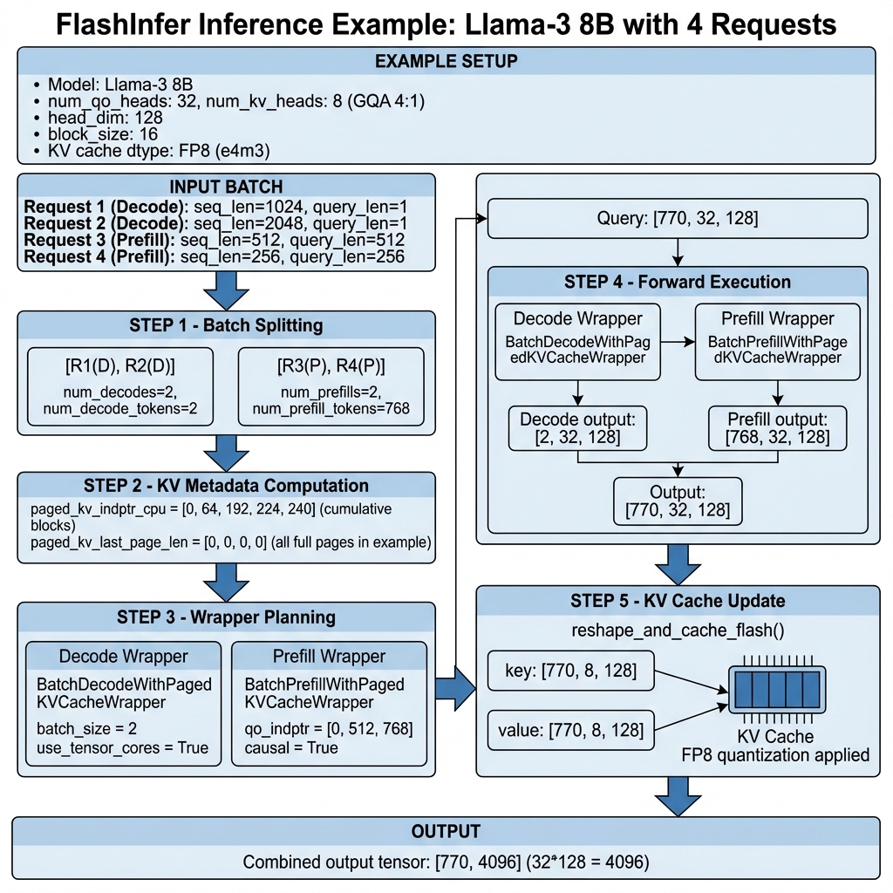

> 本文档深入分析 vLLM 中 FlashInfer 的实现原理、双路径注意力系统和优化技术。

## 目录

1. [FlashInfer 概述](#flashinfer-概述)
2. [架构设计](#架构设计)
3. [双路径注意力系统](#双路径注意力系统)
4. [FlashInfer vs FlashAttention](#flashinfer-vs-flashattention)
5. [核心实现代码分析](#核心实现代码分析)
6. [完整推理示例](#完整推理示例)
7. [CUDA Graph 支持](#cuda-graph-支持)
8. [性能优化与最佳实践](#性能优化与最佳实践)

---

## FlashInfer 概述

### 什么是 FlashInfer？

FlashInfer 是一个高性能的注意力计算库，专为 LLM 推理优化。它的核心特点包括：

1. **原生 GQA 优化**：针对 Grouped-Query Attention 的高效实现
2. **PagedKVCache 支持**：与 vLLM 的分页 KV Cache 无缝集成
3. **双路径系统**：支持原生 FlashInfer 和 TRTLLM 两种计算路径
4. **广泛硬件支持**：从 SM 7.5 到 SM 12.1 (Blackwell)
5. **量化支持**：FP8 KV Cache 和 FP4 输出量化

### 在 vLLM 中的角色

FlashInfer 作为 vLLM V1 的核心 Attention Backend 之一，特别适用于：
- Blackwell 架构 GPU（B100, B200）
- GQA 模型（Llama-3, Qwen 等）
- 需要高吞吐量的生产环境


---

## 架构设计

### 类结构概览

vLLM 中的 FlashInfer 实现由以下核心类组成：

```
vllm/v1/attention/backends/flashinfer.py
├── FlashInferBackend          # 后端定义类
├── FlashInferMetadata         # 注意力元数据
├── FlashInferMetadataBuilder  # 元数据构建器
├── FlashInferImpl             # 注意力实现
│
├── FIPrefill                  # 原生 FlashInfer Prefill
├── FIDecode                   # 原生 FlashInfer Decode
├── TRTLLMPrefill              # TRTLLM Prefill
├── TRTLLMDecode               # TRTLLM Decode
│
└── BatchDCPPrefillWrapper     # DCP 分布式 Prefill
```

### FlashInferBackend

`FlashInferBackend` 定义了 FlashInfer 后端的能力和配置：

```python
class FlashInferBackend(AttentionBackend):
    accept_output_buffer: bool = True
    supported_dtypes: ClassVar[list[torch.dtype]] = [torch.float16, torch.bfloat16]
    supported_kv_cache_dtypes: ClassVar[list[CacheDType]] = [
        "auto", "bfloat16", "fp8", "fp8_e4m3", "fp8_e5m2",
    ]

    @staticmethod
    def get_supported_kernel_block_sizes() -> list[int | MultipleOf]:
        return [16, 32, 64]  # 固定块大小
    
    @staticmethod
    def get_name() -> str:
        return "FLASHINFER"
    
    @classmethod
    def supports_compute_capability(cls, capability: DeviceCapability) -> bool:
        # 支持 SM 7.5 到 SM 12.1
        return capability >= DeviceCapability(7, 5) and capability <= DeviceCapability(12, 1)
```

**关键特性**：

| 特性 | 值 |
|------|-----|
| 支持的块大小 | 16, 32, 64 |
| 最低计算能力 | SM 7.5 (Turing) |
| 最高计算能力 | SM 12.1 (Blackwell) |
| KV Cache 形状 | `[num_blocks, 2, block_size, num_kv_heads, head_size]` |
| 支持的头部尺寸 | 64, 128, 256 |

### FlashInferMetadata

`FlashInferMetadata` 存储执行 FlashInfer 所需的元数据：

```python
@dataclass
class FlashInferMetadata:
    num_actual_tokens: int      # 实际 token 数量（不含 padding）
    slot_mapping: torch.Tensor  # KV Cache 槽位映射
    q_data_type: torch.dtype    # Query 数据类型
    
    # Prefill/Decode 分离
    num_decodes: int
    num_decode_tokens: int
    num_prefills: int
    num_prefill_tokens: int
    
    # 双路径支持
    prefill: FIPrefill | TRTLLMPrefill | None
    decode: FIDecode | TRTLLMDecode | None
    
    # Cascade Attention
    use_cascade: bool
    cascade_wrapper: MultiLevelCascadeAttentionWrapper | None
```

### FlashInferMetadataBuilder

`FlashInferMetadataBuilder` 负责构建元数据和管理 wrapper：

```python
class FlashInferMetadataBuilder(AttentionMetadataBuilder[FlashInferMetadata]):
    reorder_batch_threshold: int = 1
    
    def __init__(self, kv_cache_spec, layer_names, vllm_config, device):
        # 初始化 workspace buffer
        self._workspace_buffer = None
        self._prefill_wrapper = None
        self._decode_wrapper = None
        
        # 全局超参数
        self.num_qo_heads = model_config.get_num_attention_heads()
        self.num_kv_heads = kv_cache_spec.num_kv_heads
        self.head_dim = kv_cache_spec.head_size
        self.page_size = kv_cache_spec.block_size
        
        # TRTLLM 支持检测
        self.use_trtllm_decode_attention = can_use_trtllm_attention(...)
    
    def build(self, common_prefix_len, common_attn_metadata, fast_build=False):
        # 1. 分离 Decode 和 Prefill
        num_decodes, num_prefills, num_decode_tokens, num_prefill_tokens = \
            split_decodes_and_prefills(common_attn_metadata)
        
        # 2. 决定使用哪种路径
        prefill_use_trtllm = use_trtllm_attention(...)
        decode_use_trtllm = self.use_trtllm_decode_attention
        
        # 3. 构建并返回元数据
        return FlashInferMetadata(...)
```

---

## 双路径注意力系统

FlashInfer 在 vLLM 中实现了一个创新的双路径系统，根据硬件和配置自动选择最优路径。


### Path A: 原生 FlashInfer 路径

使用 FlashInfer 库的原生 wrapper：

**Prefill 路径**：
```python
@dataclass
class FIPrefill:
    """原生 FlashInfer Prefill 元数据"""
    wrapper: BatchPrefillWithPagedKVCacheWrapper | BatchDCPPrefillWrapper

# 使用方式
prefill_wrapper = BatchPrefillWithPagedKVCacheWrapper(
    workspace_buffer, get_kv_cache_layout()
)
prefill_wrapper.plan(
    qo_indptr_cpu,
    paged_kv_indptr_cpu,
    paged_kv_indices,
    paged_kv_last_page_len_cpu,
    num_qo_heads, num_kv_heads, head_dim, page_size,
    causal=True,
    sm_scale=sm_scale,
    window_left=window_left,
)
output = prefill_wrapper.run(query, kv_cache, k_scale, v_scale)
```

**Decode 路径**：
```python
@dataclass
class FIDecode:
    """原生 FlashInfer Decode 元数据"""
    wrapper: BatchDecodeWithPagedKVCacheWrapper

# 使用方式
decode_wrapper = BatchDecodeWithPagedKVCacheWrapper(
    workspace_buffer, get_kv_cache_layout(),
    use_cuda_graph=use_cudagraph,
    use_tensor_cores=True,
)
decode_wrapper.plan(
    paged_kv_indptr, paged_kv_indices,
    paged_kv_last_page_len, kv_data_type,
)
output = decode_wrapper.run(query, kv_cache, k_scale, v_scale)
```

### Path B: TRTLLM 加速路径

使用 NVIDIA TensorRT-LLM 的优化内核：

**TRTLLMPrefill**：
```python
@dataclass
class TRTLLMPrefill:
    """TRTLLM Prefill 元数据"""
    block_tables: torch.Tensor    # [num_prefills, max_num_blocks_per_seq]
    seq_lens: torch.Tensor        # [num_prefills]
    cum_seq_lens_q: torch.Tensor  # 累积 Query 长度
    cum_seq_lens_kv: torch.Tensor # 累积 KV 长度
    max_q_len: int
    max_seq_len: int

# 使用方式
trtllm_batch_context_with_kv_cache(
    q=prefill_query,
    kv_cache=kv_cache,
    cum_seq_lens_q=prefill.cum_seq_lens_q,
    cum_seq_lens_kv=prefill.cum_seq_lens_kv,
    max_q_len=prefill.max_q_len,
    max_kv_len=prefill.max_seq_len,
    block_table=prefill.block_tables,
    page_size=page_size,
    bmm1_scale=bmm1_scale,
    bmm2_scale=bmm2_scale,
    o=output,
    s_aux=self.sinks,  # Attention Sinks
)
```

**TRTLLMDecode**：
```python
@dataclass
class TRTLLMDecode:
    """TRTLLM Decode 元数据"""
    block_tables: torch.Tensor  # [num_decodes, max_num_blocks_per_seq]
    seq_lens: torch.Tensor      # [num_decodes]
    max_seq_len: int

# 使用方式
trtllm_batch_decode_with_kv_cache(
    q=decode_query,
    kv_cache=kv_cache,
    kv_cache_len=decode.seq_lens,
    max_kv_len=decode.max_seq_len,
    block_table=decode.block_tables,
    page_size=page_size,
    bmm1_scale=bmm1_scale,
    bmm2_scale=bmm2_scale,
    o=output,
    range_buf=range_buf,
    s_aux=self.sinks,
)
```

### 路径选择逻辑

```python
def use_trtllm_attention(
    num_qo_heads: int,
    num_kv_heads: int,
    num_tokens: int,
    max_seq_len: int,
    dcp_world_size: int,
    cache_dtype: str,
    q_data_type: torch.dtype,
    is_prefill: bool,
    force_use_trtllm: bool | None,
    has_sinks: bool,
    has_spec: bool,
) -> bool:
    """决定是否使用 TRTLLM 注意力"""
    
    # 1. 检查是否强制使用/禁用
    if force_use_trtllm is not None:
        return force_use_trtllm
    
    # 2. 检查硬件支持
    if not supports_trtllm_attention():
        return False
    
    # 3. DCP 模式不支持
    if dcp_world_size > 1:
        return False
    
    # 4. 检查 GQA 比率
    if not can_use_trtllm_attention(num_qo_heads, num_kv_heads):
        return False
    
    return True
```

---

## FlashInfer vs FlashAttention


### 功能对比表

| 特性 | FlashAttention | FlashInfer |
|------|----------------|------------|
| **底层库** | flash-attn | flashinfer |
| **最低 SM** | 8.0 (Ampere) | 7.5 (Turing) |
| **最高 SM** | 9.x (Hopper) | 12.1 (Blackwell) |
| **块大小** | MultipleOf(16) | 16, 32, 64 |
| **KV Cache 形状** | `[2, blocks, blk_size, heads, dim]` | `[blocks, 2, blk_size, heads, dim]` |
| **Encoder 支持** | ✅ | ❌ |
| **ALiBi 支持** | ✅ (FA2) | ❌ |
| **TRTLLM 集成** | ❌ | ✅ |
| **FP4 输出量化** | ❌ | ✅ |
| **Attention Sinks** | ✅ (FA3) | ✅ (via TRTLLM) |

### KV Cache 布局差异

**FlashAttention**:
```
形状: [2, num_blocks, block_size, num_kv_heads, head_size]
     ↑
     K 和 V 在第一维度分离
```

**FlashInfer**:
```
形状: [num_blocks, 2, block_size, num_kv_heads, head_size]
              ↑
              K 和 V 每个块交错存储
```

### 使用场景建议

**选择 FlashAttention**：
- Hopper GPU (H100, H200)
- 需要 Encoder Attention
- 使用 ALiBi 位置编码
- FA3 + FP8 KV Cache 场景

**选择 FlashInfer**：
- Blackwell GPU (B100, B200)
- GQA 模型 (Llama, Qwen)
- FP8/FP4 量化流水线
- 追求最高吞吐量

---

## 核心实现代码分析

### forward() 方法详解

```python
class FlashInferImpl(AttentionImpl):
    def forward(
        self,
        layer: torch.nn.Module,
        query: torch.Tensor,       # [num_tokens, num_heads, head_size]
        key: torch.Tensor,         # [num_tokens, num_kv_heads, head_size]
        value: torch.Tensor,       # [num_tokens, num_kv_heads, head_size]
        kv_cache: torch.Tensor,    # [num_blocks, 2, block_size, num_kv_heads, head_size]
        attn_metadata: FlashInferMetadata,
        output: torch.Tensor | None = None,
        output_scale: torch.Tensor | None = None,
        output_block_scale: torch.Tensor | None = None,
    ) -> torch.Tensor:
        """FlashInfer 前向传播"""
        
        # 1. 更新 KV Cache
        if self.kv_sharing_target_layer_name is None:
            torch.ops._C_cache_ops.reshape_and_cache_flash(
                key, value,
                kv_cache[:, 0], kv_cache[:, 1],
                attn_metadata.slot_mapping,
                self.kv_cache_dtype,
                layer._k_scale, layer._v_scale,
            )
        
        # 2. 处理 FP8 KV Cache
        if self.kv_cache_dtype.startswith("fp8"):
            torch_dtype = FlashInferBackend.get_fp8_dtype_for_flashinfer(
                self.kv_cache_dtype
            )
            kv_cache = kv_cache.view(torch_dtype)
        
        # 3. 处理 Cascade Attention（共享前缀）
        if attn_metadata.use_cascade:
            output.copy_(attn_metadata.cascade_wrapper.run(query, kv_cache))
            return output
        
        # 4. 调整 KV Cache 布局
        stride_order = FlashInferBackend.get_kv_cache_stride_order()
        kv_cache_permute = kv_cache.permute(*stride_order)
        
        # 5. 处理 Prefill
        if num_prefill_tokens > 0:
            prefill_query = query[num_decode_tokens:]
            
            if isinstance(attn_metadata.prefill, FIPrefill):
                # 原生 FlashInfer 路径
                prefill_wrapper.run(
                    prefill_query, kv_cache_permute,
                    k_scale=layer._k_scale_float,
                    v_scale=layer._v_scale_float,
                    out=output[num_decode_tokens:],
                )
            else:
                # TRTLLM 路径
                trtllm_batch_context_with_kv_cache(...)
        
        # 6. 处理 Decode
        if num_decode_tokens > 0:
            decode_query = query[:num_decode_tokens]
            
            if isinstance(attn_metadata.decode, FIDecode):
                # 原生 FlashInfer 路径
                decode_wrapper.run(
                    decode_query, kv_cache_permute,
                    k_scale=layer._k_scale_float,
                    v_scale=layer._v_scale_float,
                    out=output[:num_decode_tokens],
                )
            else:
                # TRTLLM 路径
                trtllm_batch_decode_with_kv_cache(...)
        
        return output
```

### KV 元数据计算

```python
def _compute_flashinfer_kv_metadata(
    self,
    num_blocks_np: np.ndarray,
    seq_lens_np: np.ndarray,
    block_table_tensor: torch.Tensor,
    num_reqs: int,
    page_size: int,
) -> torch.Tensor:
    """计算 FlashInfer 所需的 KV 元数据"""
    
    # 1. 计算 paged_kv_indptr (累积块数)
    np.cumsum(num_blocks_np, dtype=np.int32, out=self.paged_kv_indptr.np[1:num_reqs+1])
    paged_kv_indptr = self.paged_kv_indptr.gpu[:num_reqs+1]
    
    # 2. 计算 paged_kv_indices (块索引)
    num_actual_pages = self.paged_kv_indptr.np[num_reqs]
    paged_kv_indices = self.paged_kv_indices.gpu[:num_actual_pages]
    _copy_page_indices_kernel[(num_reqs,)](
        paged_kv_indices, block_table_tensor,
        block_table_tensor.stride(0), paged_kv_indptr,
    )
    
    # 3. 计算 paged_kv_last_page_len (最后一页的有效长度)
    paged_kv_last_page_len_np = seq_lens_np % page_size
    self.paged_kv_last_page_len.np[:num_reqs] = np.where(
        (paged_kv_last_page_len_np == 0) & (seq_lens_np != 0),
        page_size,
        paged_kv_last_page_len_np,
    )
    
    return paged_kv_indices
```

### Cascade Attention 实现

```python
# 使用 MultiLevelCascadeAttentionWrapper
if use_cascade:
    num_common_kv_blocks = common_prefix_len // page_size
    
    # 共享前缀元数据
    shared_qo_indptr_cpu = torch.tensor([0, num_actual_tokens], dtype=torch.int32)
    shared_kv_page_indices_cpu = block_table_tensor[0, :num_common_kv_blocks]
    
    # 规划 cascade wrapper
    cascade_wrapper = self._get_cascade_wrapper()
    cascade_wrapper.plan(
        [shared_qo_indptr_cpu, qo_indptr_cpu],           # QO 索引
        [shared_kv_page_indptr_cpu, paged_kv_indptr_cpu], # KV 页索引
        [shared_kv_page_indices_cpu, paged_kv_indices],   # 页索引
        [shared_kv_last_page_len_cpu, paged_kv_last_page_len_cpu],
        num_qo_heads, num_kv_heads, head_dim, page_size,
        causal=True, sm_scale=sm_scale,
    )
    
    # 执行时直接调用 run
    output = cascade_wrapper.run(query, kv_cache)
```

---

## 完整推理示例

下面是一个使用 FlashInfer 处理混合批次的完整示例：



### 示例场景

```python
# 模型配置
model = "Llama-3-8B"
num_qo_heads = 32
num_kv_heads = 8   # GQA 4:1
head_dim = 128
block_size = 16
kv_cache_dtype = "fp8_e4m3"

# 输入批次
batch = [
    {"type": "decode", "seq_len": 1024, "query_len": 1},   # Request 1
    {"type": "decode", "seq_len": 2048, "query_len": 1},   # Request 2
    {"type": "prefill", "seq_len": 512, "query_len": 512}, # Request 3
    {"type": "prefill", "seq_len": 256, "query_len": 256}, # Request 4
]
```

### Step 1: 批次分离

```python
# 分离结果
num_decodes = 2
num_decode_tokens = 2
num_prefills = 2
num_prefill_tokens = 768

# 重排序后的批次
# [Decode_1, Decode_2, Prefill_3, Prefill_4]
# 位置: [0, 1, 2, 770)
```

### Step 2: KV 元数据计算

```python
# 每个请求的块数
# R1: ceil(1024/16) = 64 blocks
# R2: ceil(2048/16) = 128 blocks
# R3: ceil(512/16) = 32 blocks
# R4: ceil(256/16) = 16 blocks

paged_kv_indptr = [0, 64, 192, 224, 240]  # 累积和
paged_kv_last_page_len = [0, 0, 0, 0]     # 都是满页

# paged_kv_indices 从 block_table 复制
```

### Step 3: Wrapper 规划

```python
# Decode Wrapper
decode_wrapper = BatchDecodeWithPagedKVCacheWrapper(
    workspace_buffer,
    use_tensor_cores=True,
)
decode_wrapper.plan(
    paged_kv_indptr[:3],      # [0, 64, 192]
    paged_kv_indices[:192],   # 前192个块索引
    paged_kv_last_page_len[:2],
    seq_lens[:2],             # [1024, 2048]
    num_qo_heads, num_kv_heads, head_dim,
)

# Prefill Wrapper
prefill_wrapper = BatchPrefillWithPagedKVCacheWrapper(
    workspace_buffer,
)
prefill_wrapper.plan(
    qo_indptr=[0, 512, 768],  # Prefill Query 索引
    paged_kv_indptr=[0, 32, 48],
    paged_kv_indices=paged_kv_indices[192:],
    paged_kv_last_page_len=[0, 0],
    num_qo_heads, num_kv_heads, head_dim, page_size,
    causal=True,
)
```

### Step 4: 前向执行

```python
# 输入张量
query = torch.randn(770, 32, 128, dtype=torch.bfloat16)  # [num_tokens, heads, dim]
key = torch.randn(770, 8, 128, dtype=torch.bfloat16)
value = torch.randn(770, 8, 128, dtype=torch.bfloat16)
output = torch.empty(770, 32, 128, dtype=torch.bfloat16)

# KV Cache 更新
reshape_and_cache_flash(key, value, kv_cache, slot_mapping, "fp8_e4m3", k_scale, v_scale)

# Decode 执行
decode_output = decode_wrapper.run(query[:2], kv_cache, k_scale, v_scale)
output[:2] = decode_output

# Prefill 执行
prefill_output = prefill_wrapper.run(query[2:], kv_cache, k_scale, v_scale)
output[2:] = prefill_output
```

### Step 5: 输出

```python
# 最终输出
output.shape  # [770, 32, 128]
output = output.view(770, -1)  # [770, 4096]
```

---

## CUDA Graph 支持

FlashInfer 在 vLLM 中支持两种 CUDA Graph 模式：

### 支持级别

```python
@classmethod
def get_cudagraph_support(cls, vllm_config, kv_cache_spec) -> AttentionCGSupport:
    has_trtllm_support = can_use_trtllm_attention(
        num_qo_heads=..., num_kv_heads=...
    )
    if has_trtllm_support:
        return AttentionCGSupport.UNIFORM_BATCH
    else:
        return AttentionCGSupport.UNIFORM_SINGLE_TOKEN_DECODE
```

| 模式 | 条件 | 说明 |
|------|------|------|
| `UNIFORM_BATCH` | TRTLLM 可用 | 支持均匀批次大小 |
| `UNIFORM_SINGLE_TOKEN_DECODE` | 仅原生 FlashInfer | 仅支持单 token decode |

### Decode Wrapper 与 CUDA Graph

```python
if use_cudagraph:
    # 每个批次大小需要单独的 decode wrapper
    decode_wrapper = self._decode_wrappers_cudagraph.get(batch_size)
    if decode_wrapper is None:
        decode_wrapper = BatchDecodeWithPagedKVCacheWrapper(
            workspace_buffer,
            use_cuda_graph=True,
            paged_kv_indptr_buffer=paged_kv_indptr,
            paged_kv_indices_buffer=paged_kv_indices,
            paged_kv_last_page_len_buffer=paged_kv_last_page_len,
        )
        self._decode_wrappers_cudagraph[batch_size] = decode_wrapper
```

---

## 性能优化与最佳实践

### 配置建议

```python
# 1. 块大小选择
# Blackwell (SM 10): 避免 block_size=16 + head_dim=256 组合
if head_dim == 256 and device_capability.major == 10:
    block_size = 32  # 或 64

# 2. TRTLLM 加速
# 对于 GQA 模型，自动使用 TRTLLM
# 可以通过配置强制开启/关闭
--attention-config.use_trtllm_attention=1

# 3. Workspace Buffer 大小
# 默认: VLLM_FLASHINFER_WORKSPACE_BUFFER_SIZE
# Batch Invariant 模式: 2GB
if vllm_is_batch_invariant():
    buffer_size = 2048 * 1024 * 1024  # 2GB
```

### 性能对比

| 场景 | 原生 FlashInfer | TRTLLM 加速 | 提升 |
|------|-----------------|-------------|------|
| Decode (GQA 4:1) | 基准 | +15-25% | - |
| Prefill (长序列) | 基准 | +10-20% | - |
| FP8 KV Cache | 基准 | +30-40% | 内存减半 |
| FP4 输出 | N/A | 支持 | 带宽优化 |

### 最佳实践

1. **Blackwell GPU**：默认使用 FlashInfer + TRTLLM
2. **Hopper GPU**：考虑 FlashAttention FA3
3. **GQA 模型**：FlashInfer 通常更优
4. **长上下文**：启用 Cascade Attention
5. **量化**：使用 FP8 KV Cache 节省内存

---

## 相关文件

| 文件路径 | 说明 |
|----------|------|
| `vllm/v1/attention/backends/flashinfer.py` | FlashInfer 主实现 (1734行) |
| `vllm/utils/flashinfer.py` | FlashInfer 工具函数 |
| `vllm/v1/attention/backends/utils.py` | 通用工具函数 |
| `vllm/v1/attention/ops/merge_attn_states.py` | 注意力状态合并 |

---

## 总结

FlashInfer 是 vLLM 中一个功能强大的 Attention Backend，其核心优势包括：

1. **双路径系统**：原生 FlashInfer + TRTLLM 加速
2. **广泛硬件支持**：从 Turing 到 Blackwell
3. **原生 GQA 优化**：针对现代 LLM 架构
4. **量化支持**：FP8 KV Cache + FP4 输出
5. **Cascade Attention**：共享前缀优化

对于 Blackwell GPU 和 GQA 模型，FlashInfer 通常是最优选择。

---

## 参考资料

1. [FlashInfer GitHub](https://github.com/flashinfer-ai/flashinfer)
2. [vLLM 官方文档](https://docs.vllm.ai/)
3. [TensorRT-LLM Attention Kernels](https://github.com/NVIDIA/TensorRT-LLM)
