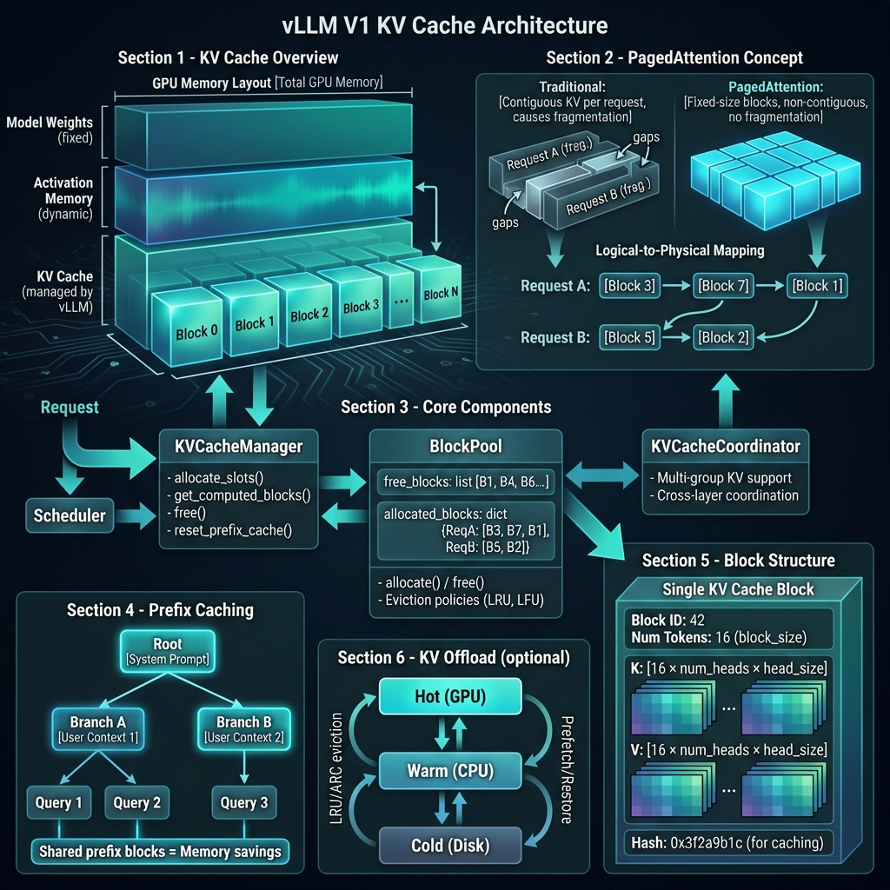

## 📋 概述

KV Cache 是大语言模型推理中最重要的优化技术之一。本文档详细介绍 vLLM 中 KV Cache 的工作原理、实现细节和优化策略。

---

## 🧠 什么是 KV Cache？

在 Transformer 的自注意力机制中，每个 token 都需要与之前所有 token 进行注意力计算。如果每次生成新 token 都重新计算所有的 Key 和 Value 向量，计算量会非常大。

**KV Cache 的核心思想**：缓存已计算的 Key 和 Value 向量，避免重复计算。

### 数学原理

```
Attention(Q, K, V) = softmax(QK^T / √d_k) × V

其中：
- Q (Query): 当前 token 的查询向量
- K (Key): 所有 token 的键向量
- V (Value): 所有 token 的值向量
```

**没有 KV Cache**：
```
Step 1: 计算 token_0 的 K_0, V_0 → 生成 token_1
Step 2: 计算 token_0, token_1 的 K_0, K_1, V_0, V_1 → 生成 token_2
Step 3: 计算 token_0, token_1, token_2 的 K, V → 生成 token_3
...
计算复杂度: O(n²) 随序列长度平方增长
```

**有 KV Cache**：
```
Step 1: 计算并缓存 K_0, V_0 → 生成 token_1
Step 2: 使用缓存的 K_0, V_0，只计算新的 K_1, V_1 并缓存 → 生成 token_2
Step 3: 使用缓存的 K_0, K_1, V_0, V_1，只计算 K_2, V_2 并缓存 → 生成 token_3
...
计算复杂度: O(n) 线性增长
```

---

## 🎯 传统 KV Cache 的问题

### 内存碎片化

传统实现为每个请求预分配固定大小的连续内存：

```
┌─────────────────────────────────────────────────┐
│ Request A: [████████████____________]           │ ← 预分配 max_seq_len
│            实际使用      预留但未使用            │
├─────────────────────────────────────────────────┤
│ Request B: [████_______________]                │ ← 短请求浪费更多
├─────────────────────────────────────────────────┤
│ Request C: [████████████████████████████████]   │ ← 长请求可能超出
└─────────────────────────────────────────────────┘
```

**问题**：
1. **内存浪费**：预分配但未使用的内存高达 60-80%
2. **批大小受限**：因碎片化无法充分利用 GPU 内存
3. **不灵活**：无法适应变长序列

---

## 🚀 vLLM 的 PagedAttention 方案

vLLM 提出了 **PagedAttention**，借鉴操作系统虚拟内存的分页机制，将 KV Cache 切分为固定大小的块（block）进行管理。

### 核心设计



**关键概念**：

| 概念 | 说明 |
|------|------|
| **Block** | 固定大小的 KV 存储单元，通常 16 tokens |
| **Block Size** | 每个块存储的 token 数量 |
| **Block Table** | 逻辑块到物理块的映射表 |
| **Block Pool** | 管理所有可用块的池 |

### 块结构

```python
# 单个 KV Cache 块的结构
Block {
    block_id: int           # 物理块 ID
    num_tokens: int         # 已填充的 token 数 (0 ~ block_size)
    
    # 每层每头的 KV 向量
    k_cache: [block_size, num_heads, head_size]  # Key 缓存
    v_cache: [block_size, num_heads, head_size]  # Value 缓存
    
    # 用于前缀缓存的哈希值
    block_hash: Optional[int]
}
```

### 非连续内存分配

```
传统连续分配：
Request A: [Block 0][Block 1][Block 2][Block 3] ← 必须连续

PagedAttention 非连续分配：
Request A: [Block 0] → [Block 5] → [Block 2] → [Block 8]
                  ↓          ↓          ↓          ↓
           物理位置不连续，通过 Block Table 映射
```

---

## 📊 KV Cache 演变过程

### 推理过程中的 KV Cache 变化

下图展示了单个请求从 Prefill 到 Decode 阶段 KV Cache 的变化：


#### Phase 1: Prefill（预填充阶段）

```
输入 Prompt: "Hello, how are you?" (5 tokens)

1. 一次性计算所有 token 的 K, V
2. 分配足够的块存储这些 KV
3. 块状态: [B0: full][B1: partial]

GPU 计算: 并行处理所有 5 个 token
内存操作: 批量写入 KV Cache
```

#### Phase 2: Decode（解码阶段）

```
生成第 1 个 token: "I"
├─ Query: 只有新 token
├─ Key/Value: 新 token + 缓存的所有 KV
├─ 写入新的 K, V 到当前块 (B1)
└─ 如果块满，分配新块

生成第 2 个 token: "am"
├─ 同上，累积 KV Cache
└─ ...

生成第 N 个 token: 
├─ KV Cache 持续增长
└─ 动态分配新块
```

### 多请求批处理场景

下图展示了多个并发请求同时运行时 KV Cache 的动态变化：


#### Timeline 详解

| 时间 | 事件 | Block Pool 状态 | GPU 内存使用 |
|------|------|-----------------|--------------|
| T=0 | 初始状态 | 所有块空闲 | 0% |
| T=1 | Request A Prefill | B0, B1 分配给 A | 20% |
| T=2 | Request B 加入 | B3-B5 分配给 B，B2 分配给 A | 60% |
| T=3 | Request C 加入 | B7-B8 分配给 C，B6 分配给 B | 90% |
| T=4 | Request A 完成 | B0-B2 释放回池 | 70% |
| T=5 | Request D 复用 | B0, B1 被 D 复用 | 80% |

**关键洞察**：
- 块在请求完成后**立即释放**
- 新请求可以**复用已释放的块**
- **无需预分配**固定大小内存
- GPU 利用率可达 **90%+**

---

## 🔧 核心组件详解

### 1. BlockPool（块池）

```python
class BlockPool:
    """管理所有 KV Cache 块的池"""
    
    def __init__(self, num_blocks: int, block_size: int):
        self.free_blocks: List[int] = list(range(num_blocks))
        self.allocated_blocks: Dict[str, List[int]] = {}
    
    def allocate(self, request_id: str) -> int:
        """从池中分配一个块"""
        if not self.free_blocks:
            raise OutOfMemoryError("No free blocks available")
        block_id = self.free_blocks.pop()
        self.allocated_blocks.setdefault(request_id, []).append(block_id)
        return block_id
    
    def free(self, request_id: str):
        """释放请求的所有块"""
        blocks = self.allocated_blocks.pop(request_id, [])
        self.free_blocks.extend(blocks)
```

### 2. KVCacheManager（缓存管理器）

```python
class KVCacheManager:
    """KV Cache 的高级管理接口"""
    
    def get_computed_blocks(self, request: Request) -> Tuple[List[Block], int]:
        """获取请求的已计算块（用于前缀缓存）"""
        # 检查是否有可复用的前缀
        cached_blocks = self.prefix_cache.lookup(request.prompt_hash)
        return cached_blocks, len(cached_blocks) * self.block_size
    
    def allocate_slots(self, request: Request, num_tokens: int) -> List[int]:
        """为新 token 分配 KV 槽位"""
        required_blocks = ceil(num_tokens / self.block_size)
        allocated = []
        for _ in range(required_blocks):
            block = self.block_pool.allocate(request.request_id)
            allocated.append(block)
        return allocated
    
    def free(self, request: Request):
        """释放请求的所有 KV Cache"""
        self.block_pool.free(request.request_id)
```

### 3. Block Table（块表）

```python
# 逻辑块到物理块的映射
class BlockTable:
    """
    Request 的块映射表
    
    Logical Index:  [0,  1,  2,  3,  4]
                     ↓   ↓   ↓   ↓   ↓
    Physical Block: [B0, B5, B2, B8, B3]
    """
    
    def __init__(self):
        self.mapping: List[int] = []  # logical_idx -> physical_block_id
    
    def append(self, physical_block_id: int):
        self.mapping.append(physical_block_id)
    
    def get_physical_blocks(self) -> List[int]:
        return self.mapping
```

---

## 🌳 前缀缓存 (Prefix Caching)

### 原理

当多个请求共享相同的前缀（如系统提示词）时，可以复用已计算的 KV Cache。

```
Request 1: "System: You are a helpful assistant. User: Hi"
Request 2: "System: You are a helpful assistant. User: Hello"
Request 3: "System: You are a helpful assistant. User: Help me"
           └──────────────共同前缀──────────────┘└─不同部分─┘
```

### 实现

```python
# 前缀缓存使用树状结构
class PrefixCache:
    """
    树状结构存储前缀
    
           [Root]
              │
    [System: You are helpful]  ← 共享块 (Block 0-3)
         /        |        \
    [User: Hi] [User: Hello] [User: Help]
    (Block 4)   (Block 5)    (Block 6)
    """
    
    def lookup(self, token_ids: List[int]) -> List[Block]:
        """查找可复用的前缀块"""
        hash_key = self.compute_hash(token_ids)
        return self.cache.get(hash_key, [])
    
    def insert(self, token_ids: List[int], blocks: List[Block]):
        """插入新的前缀到缓存"""
        hash_key = self.compute_hash(token_ids)
        self.cache[hash_key] = blocks
```

### 节省效果

```
不使用前缀缓存:
- Request 1: 5 blocks
- Request 2: 5 blocks  
- Request 3: 5 blocks
- 总计: 15 blocks

使用前缀缓存:
- 共享前缀: 4 blocks (只计算一次)
- Request 1 后缀: 1 block
- Request 2 后缀: 1 block
- Request 3 后缀: 1 block
- 总计: 7 blocks (节省 53%!)
```

---

## 💾 KV Offload（缓存卸载）

对于超长上下文，GPU 内存可能不足。vLLM 支持将部分 KV Cache 卸载到 CPU 或磁盘。

### 分层架构

```
┌─────────────────────────────────────────┐
│           Hot (GPU Memory)              │ ← 最近使用，访问最快
│  ┌─────┐ ┌─────┐ ┌─────┐ ┌─────┐       │
│  │ B0  │ │ B1  │ │ B2  │ │ B3  │       │
│  └─────┘ └─────┘ └─────┘ └─────┘       │
└─────────────────────────────────────────┘
                    ↕ LRU/ARC eviction
┌─────────────────────────────────────────┐
│           Warm (CPU Memory)             │ ← 较少使用，访问较慢
│  ┌─────┐ ┌─────┐ ┌─────┐ ┌─────┐       │
│  │ B4  │ │ B5  │ │ B6  │ │ B7  │       │
│  └─────┘ └─────┘ └─────┘ └─────┘       │
└─────────────────────────────────────────┘
                    ↕ eviction
┌─────────────────────────────────────────┐
│           Cold (Disk/SSD)               │ ← 很少使用，访问最慢
│  ┌─────┐ ┌─────┐ ┌─────┐ ┌─────┐       │
│  │ B8  │ │ B9  │ │ B10 │ │ ... │       │
│  └─────┘ └─────┘ └─────┘ └─────┘       │
└─────────────────────────────────────────┘
```

### 驱逐策略

| 策略 | 说明 |
|------|------|
| **LRU** | Least Recently Used，最近最少使用 |
| **ARC** | Adaptive Replacement Cache，自适应替换 |

---

## 📈 性能优化技术

### 1. CUDA Graphs

减少 CPU-GPU 通信开销：

```python
# 首次运行：捕获计算图
with torch.cuda.graph(graph):
    output = model(input)

# 后续运行：重放计算图
graph.replay()  # 极低的 CPU 开销
```

### 2. Slot Mapping 优化

```python
# 将逻辑位置映射到物理位置
slot_mapping = torch.tensor([
    block_table[logical_idx] * block_size + offset
    for logical_idx, offset in token_positions
])

# 使用索引直接写入 KV Cache
kv_cache[slot_mapping] = new_kv
```

### 3. Flash Attention 集成

```python
# Flash Attention 支持分页 KV Cache
flash_attn_with_kvcache(
    q=query,                    # [batch, 1, heads, head_dim]
    k_cache=k_cache,            # [num_blocks, block_size, heads, head_dim]
    v_cache=v_cache,            # [num_blocks, block_size, heads, head_dim]
    block_table=block_table,    # [batch, max_blocks]
    cache_seqlens=seq_lens,     # [batch]
)
```

---

## 📊 内存计算

### KV Cache 大小公式

```
单层 KV Cache 大小 = 2 × num_heads × head_size × seq_len × dtype_size

总 KV Cache 大小 = num_layers × 单层大小

示例 (Llama-2-7B):
- num_layers = 32
- num_heads = 32  
- head_size = 128
- seq_len = 4096
- dtype = float16 (2 bytes)

单层 = 2 × 32 × 128 × 4096 × 2 = 64 MB
总计 = 32 × 64 MB = 2 GB per request!
```

### 块数量计算

```
所需块数 = ceil(seq_len / block_size)

示例:
- seq_len = 4096
- block_size = 16
- 所需块数 = ceil(4096 / 16) = 256 blocks
```

---

## 🔗 相关代码位置

| 模块 | 文件路径 | 说明 |
|------|----------|------|
| KV Cache 管理器 | `vllm/v1/core/kv_cache_manager.py` | 高级管理接口 |
| 块池 | `vllm/v1/core/block_pool.py` | 块分配/释放 |
| KV Cache 工具 | `vllm/v1/core/kv_cache_utils.py` | 辅助函数 (66KB) |
| 块表 | `vllm/v1/worker/block_table.py` | 块映射表 |
| Attention 后端 | `vllm/v1/attention/backends/` | 各种注意力实现 |
| KV Offload | `vllm/v1/kv_offload/` | 缓存卸载 |

---

## 📚 参考资料

- [vLLM: Easy, Fast, and Cheap LLM Serving with PagedAttention](https://arxiv.org/abs/2309.06180)
- [FlashAttention-2: Faster Attention with Better Parallelism](https://arxiv.org/abs/2307.08691)
- [vLLM 官方文档](https://docs.vllm.ai/)

---

## 🎯 总结

vLLM 的 KV Cache 管理通过以下创新实现了高效内存利用：

| 技术 | 效果 |
|------|------|
| **PagedAttention** | 消除内存碎片，提高利用率 50%+ |
| **非连续分配** | 灵活的内存管理 |
| **前缀缓存** | 共享计算，减少重复 |
| **动态分配** | 按需分配，无浪费 |
| **即时释放** | 块可立即复用 |
| **KV Offload** | 支持超长上下文 |

这些技术共同使 vLLM 成为目前最高效的开源 LLM 推理引擎之一。
