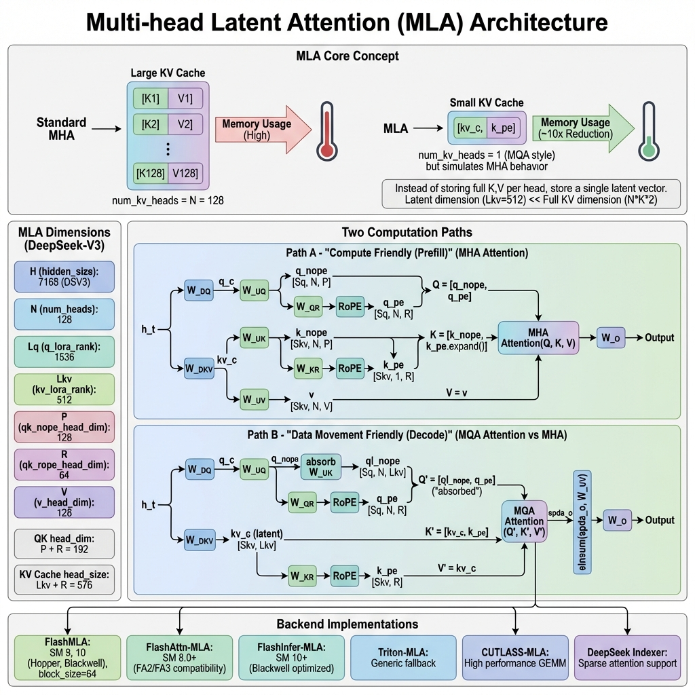
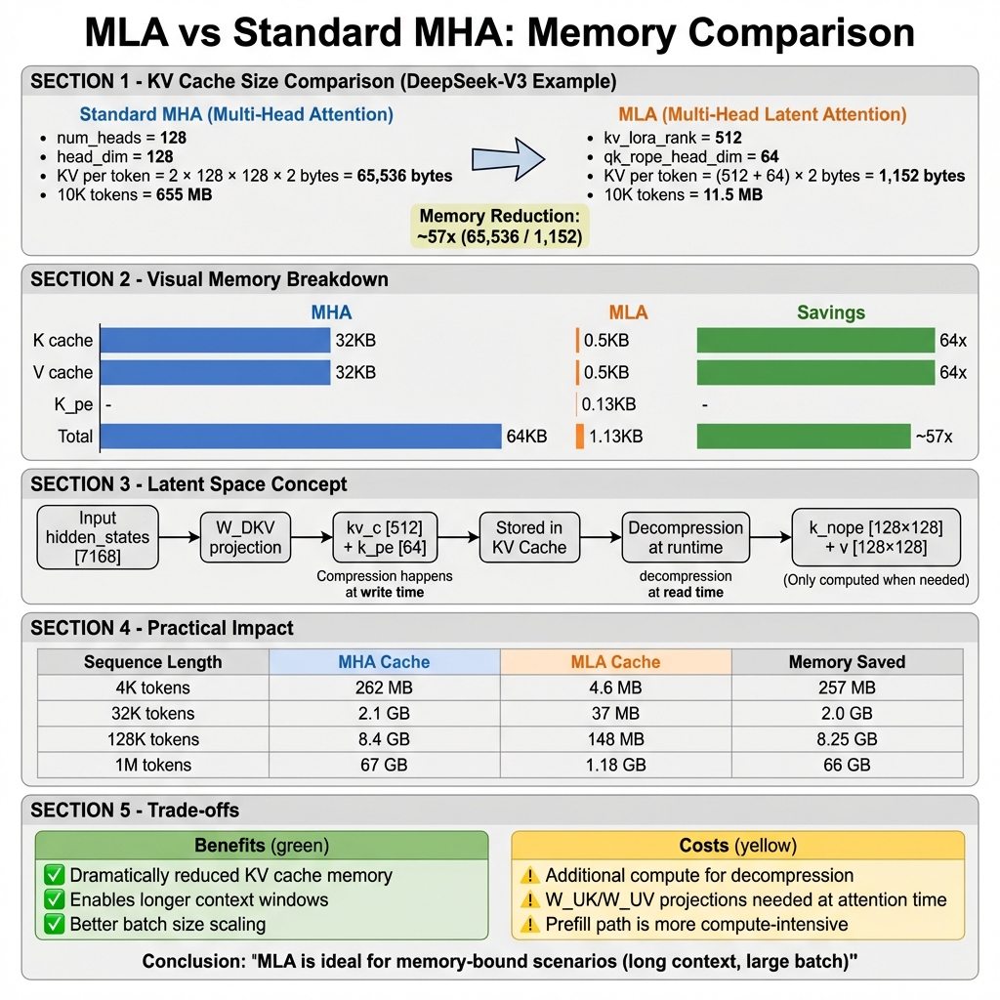

> 本文档深入分析 vLLM 中的 MLA 注意力机制，包括原理、实现、Backend 比较和性能优化。

## 目录

1. [MLA 概述](#mla-概述)
2. [核心原理](#核心原理)
3. [MLA 维度解析](#mla-维度解析)
4. [双路径计算](#双路径计算)
5. [KV Cache 压缩](#kv-cache-压缩)
6. [vLLM Backend 实现](#vllm-backend-实现)
7. [完整代码示例](#完整代码示例)
8. [性能与最佳实践](#性能与最佳实践)

---

## MLA 概述

### 什么是 MLA？

**Multi-head Latent Attention (MLA)** 是 DeepSeek 团队在 DeepSeek-V2 论文中提出的一种高效注意力机制。其核心创新在于：

1. **潜在空间压缩**：不存储完整的 K, V 向量，而是存储一个低维潜在向量
2. **MQA 存储 + MHA 计算**：存储时使用类 MQA 结构（`num_kv_heads=1`），计算时模拟 MHA 行为
3. **巨大的内存节省**：KV Cache 大小降低 50-60x

### 支持 MLA 的模型

| 模型 | MLA 版本 | 备注 |
|------|----------|------|
| DeepSeek-V2 | Dense MLA | 原始 MLA 实现 |
| DeepSeek-V2.5 | Dense MLA | 改进版 |
| DeepSeek-V3 | Dense/Sparse MLA | 支持稀疏注意力 |
| DeepSeek-V3.2 | Sparse MLA | 深度稀疏优化 |
| DeepSeek-R1 | Dense MLA | 推理模型 |



---

## 核心原理

### 从 MHA 到 MLA 的演进

**标准 Multi-Head Attention (MHA)**：
```
K_i = h_t @ W_K_i    # 每个头独立的 K 投影
V_i = h_t @ W_V_i    # 每个头独立的 V 投影
KV Cache: [num_heads × head_dim × 2] per token
```

**Multi-Query Attention (MQA)**：
```
K = h_t @ W_K        # 所有头共享一个 K
V = h_t @ W_V        # 所有头共享一个 V
KV Cache: [head_dim × 2] per token
```

**Multi-head Latent Attention (MLA)**：
```
kv_c = h_t @ W_DKV   # 低维潜在向量 (kv_lora_rank)
k_pe = h_t @ W_KR    # 解耦的位置编码
KV Cache: [kv_lora_rank + rope_dim] per token

# 运行时解压缩
k_nope = kv_c @ W_UK  # 恢复 K（无位置编码部分）
v = kv_c @ W_UV       # 恢复 V
```

### 核心公式

**Q 投影**（带 LoRA 压缩时）：
```python
q_c = h_t @ W_DQ                    # [Sq, H] → [Sq, Lq]
q_c = layernorm(q_c)
q = q_c @ W_UQ                      # [Sq, Lq] → [Sq, N, P]
q_pe = RoPE(q_c @ W_QR)             # [Sq, Lq] → [Sq, N, R]
q = concat(q_nope, q_pe)            # [Sq, N, P+R]
```

**KV 投影与缓存**：
```python
kv_c = h_t @ W_DKV                  # [Sq, H] → [Sq, Lkv]
k_pe = RoPE(h_t @ W_KR)             # [Sq, H] → [Sq, R]
kv_c_normed = layernorm(kv_c)

# 存储到 KV Cache
cache = concat(kv_c_normed, k_pe)   # [Sq, Lkv+R]
```

---

## MLA 维度解析

以 **DeepSeek-V3** 为例：

| 维度 | 符号 | 值 | 说明 |
|------|------|-----|------|
| hidden_size | H | 7168 | 模型隐藏层维度 |
| num_heads | N | 128 | 注意力头数量 |
| q_lora_rank | Lq | 1536 | Q 的 LoRA 维度 |
| kv_lora_rank | Lkv | 512 | KV 的潜在维度 |
| qk_nope_head_dim | P | 128 | Q/K 非位置编码维度 |
| qk_rope_head_dim | R | 64 | Q/K RoPE 维度 |
| v_head_dim | V | 128 | V 头维度 |
| **QK head_dim** | P+R | **192** | Q/K 完整头维度 |
| **KV Cache head_size** | Lkv+R | **576** | KV Cache 每 token 大小 |

### 内存对比计算

**标准 MHA (DeepSeek-V3 规模)**：
```
K per token = num_heads × head_dim × sizeof(fp16)
            = 128 × 128 × 2 = 32,768 bytes
V per token = 128 × 128 × 2 = 32,768 bytes
Total = 65,536 bytes / token
```

**MLA**：
```
kv_c = kv_lora_rank × sizeof(fp16) = 512 × 2 = 1,024 bytes
k_pe = qk_rope_head_dim × sizeof(fp16) = 64 × 2 = 128 bytes
Total = 1,152 bytes / token
```

**内存节省：65,536 / 1,152 ≈ 57x**

---

## 双路径计算

MLA 根据场景使用两种不同的计算路径：


### Path A: Prefill 路径（计算友好）

适用于 Sq/Skv 比率接近 1 的场景（长序列预填充），使用 MHA 风格计算：

```python
def _forward_prefill(self, q, kv_c_normed, k_pe, ...):
    """MHA-style prefill: 数据在 KV 端展开"""
    
    # 1. 展开 KV
    k_nope = kv_c_normed @ self.W_UK          # [Skv, Lkv] → [Skv, N, P]
    v = kv_c_normed @ self.W_UV               # [Skv, Lkv] → [Skv, N, V]
    
    # 2. 广播 k_pe 到所有头
    k_pe_expanded = k_pe.expand(-1, N, -1)    # [Skv, 1, R] → [Skv, N, R]
    
    # 3. 拼接 K
    k = torch.cat([k_nope, k_pe_expanded], dim=-1)  # [Skv, N, P+R]
    
    # 4. 标准 MHA 注意力
    attn_output = flash_attn_varlen_func(
        q=q,                    # [Sq, N, P+R]
        k=k,                    # [Skv, N, P+R]
        v=v,                    # [Skv, N, V]
        cu_seqlens=cu_seqlens,
        causal=True,
    )
    
    # 5. 输出投影
    return attn_output @ self.W_O
```

**特点**：
- 计算量大（需要展开 KV）
- 内存带宽压力小（批量连续访问）
- 适合长 prompt 预填充

### Path B: Decode 路径（内存友好）

适用于 Sq/Skv 比率较大的场景（自回归解码），使用 MQA 风格计算：

```python
def _forward_decode(self, q, kv_c_and_k_pe_cache, ...):
    """MQA-style decode: 权重吸收到 Q 端"""
    
    # 1. 分离 Q 的 nope 和 pe 部分
    q_nope = q[..., :P]                         # [Sq, N, P]
    q_pe = q[..., P:]                           # [Sq, N, R]
    
    # 2. 吸收 W_UK 到 Q 端 (关键优化!)
    # q_nope @ k_nope.T = q_nope @ (kv_c @ W_UK).T
    #                   = (q_nope @ W_UK.T) @ kv_c.T
    #                   = ql_nope @ kv_c.T
    ql_nope = einsum("snh,lnh->snl", q_nope, self.W_UK)  # [Sq, N, Lkv]
    
    # 3. 拼接吸收后的 Q
    decode_q = torch.cat([ql_nope, q_pe], dim=-1)       # [Sq, N, Lkv+R]
    
    # 4. MQA 风格注意力 (KV Cache 直接使用)
    attn_output, lse = flash_mla_with_kvcache(
        q=decode_q,                           # [Sq, N, Lkv+R]
        k_cache=kv_c_and_k_pe_cache,          # [Skv, 1, Lkv+R] (from PagedKVCache)
        block_table=block_table,
        cache_seqlens=seq_lens,
        head_dim_v=self.kv_lora_rank,         # Output is Lkv dim
    )
    
    # 5. 逆吸收 W_UV 恢复输出
    # attn_output 是 [Sq, N, Lkv]，需要投影回 [Sq, N, V]
    output = einsum("snl,lnv->snv", attn_output, self.W_UV)
    
    # 6. 输出投影
    return output.reshape(Sq, N*V) @ self.W_O
```

**特点**：
- 计算量小（权重吸收避免 KV 展开）
- 内存带宽是瓶颈（类 MQA 访问模式）
- 适合自回归生成

### 权重吸收原理

吸收技巧的数学基础：

```
标准计算:
score = Q @ K.T
      = Q @ (KV_c @ W_UK).T
      = Q @ W_UK.T @ KV_c.T
      = (Q @ W_UK.T) @ KV_c.T
      = Q' @ KV_c.T              # Q' 是 "吸收" 后的 Q

其中:
Q  shape: [Sq, N, P]
W_UK shape: [Lkv, N, P]
Q' shape: [Sq, N, Lkv]
KV_c shape: [Skv, Lkv]
```

通过吸收，我们避免了将 `KV_c [Skv, Lkv]` 展开为 `K [Skv, N, P]` 的巨大中间矩阵。

---

## KV Cache 压缩



### KV Cache 格式

MLA 的 KV Cache 格式与标准注意力不同：

```python
# 标准 FlashAttention KV Cache
# Shape: [2, num_blocks, block_size, num_kv_heads, head_size]

# MLA KV Cache
# Shape: [num_blocks, block_size, head_size]
# 其中 head_size = kv_lora_rank + qk_rope_head_dim = 576
# num_kv_heads = 1 (隐含)
```

vLLM 中的 KV Cache 配置：

```python
class MLACommonBackend(AttentionBackend):
    @staticmethod
    def get_kv_cache_shape(
        num_blocks: int,
        block_size: int,
        num_kv_heads: int,  # 对于 MLA 假定为 1
        head_size: int,     # Lkv + R = 576
        cache_dtype_str: str = "auto",
    ) -> tuple[int, ...]:
        return (num_blocks, block_size, head_size)
    
    @classmethod
    def get_supported_head_sizes(cls) -> list[int]:
        return [576]  # DeepSeek 系列模型专用
```

### 内存节省实例

| 序列长度 | 标准 MHA Cache | MLA Cache | 节省 |
|----------|----------------|-----------|------|
| 4K tokens | 262 MB | 4.6 MB | 257 MB (98%) |
| 32K tokens | 2.1 GB | 37 MB | 2.0 GB (98%) |
| 128K tokens | 8.4 GB | 148 MB | 8.25 GB (98%) |
| 1M tokens | 67 GB | 1.18 GB | 66 GB (98%) |

---

## vLLM Backend 实现

vLLM 为 MLA 提供了多种 Backend 实现：


### 类层次结构

```
vllm/v1/attention/backends/mla/
├── __init__.py
├── flashmla.py            # FlashMLA Backend (SM 9, 10)
├── flashmla_sparse.py     # FlashMLA Sparse (DeepSeek-V3.2)
├── flashattn_mla.py       # FlashAttention MLA (SM 8.0+)
├── flashinfer_mla.py      # FlashInfer MLA (SM 10+)
├── cutlass_mla.py         # CUTLASS MLA (高性能 GEMM)
├── triton_mla.py          # Triton MLA (通用回退)
├── aiter_triton_mla.py    # AMD AITER + Triton
├── rocm_aiter_mla.py      # ROCm AITER MLA
├── rocm_aiter_mla_sparse.py
└── indexer.py             # DeepSeek V3.2 Indexer
```

### FlashMLA Backend

```python
class FlashMLABackend(MLACommonBackend):
    supported_dtypes: ClassVar[list[torch.dtype]] = [torch.float16, torch.bfloat16]
    supported_kv_cache_dtypes: ClassVar[list[CacheDType]] = [
        "auto", "bfloat16", "fp8", "fp8_e4m3",
    ]

    @staticmethod
    def get_supported_kernel_block_sizes() -> list[int | MultipleOf]:
        return [64]  # 固定 block_size=64
    
    @classmethod
    def supports_compute_capability(cls, capability: DeviceCapability) -> bool:
        return capability.major in [9, 10]  # Hopper, Blackwell

class FlashMLAImpl(MLACommonImpl[FlashMLAMetadata]):
    def _forward_decode(self, q, kv_c_and_k_pe_cache, attn_metadata, layer):
        # 使用 FlashMLA 内核
        if self.kv_cache_dtype.startswith("fp8"):
            o, lse = flash_mla_with_kvcache_fp8(
                q=q,
                k_cache=kv_c_and_k_pe_cache.unsqueeze(-2),
                block_table=attn_metadata.decode.block_table,
                cache_seqlens=attn_metadata.decode.seq_lens,
                head_dim_v=self.kv_lora_rank,
                tile_scheduler_metadata=scheduler_metadata.tile_scheduler_metadata,
                num_splits=scheduler_metadata.num_splits,
                softmax_scale=self.scale,
                causal=True,
                descale_q=layer._q_scale.reshape(1),
                descale_k=layer._k_scale.reshape(1),
            )
        else:
            o, lse = flash_mla_with_kvcache(
                q=q,
                k_cache=kv_c_and_k_pe_cache.unsqueeze(-2),
                block_table=attn_metadata.decode.block_table,
                cache_seqlens=attn_metadata.decode.seq_lens,
                head_dim_v=self.kv_lora_rank,
                tile_scheduler_metadata=scheduler_metadata,
                softmax_scale=self.scale,
                causal=True,
            )
        return o, lse
```

### FlashAttention-MLA Backend

```python
class FlashAttnMLABackend(MLACommonBackend):
    supported_kv_cache_dtypes: ClassVar[list[CacheDType]] = ["auto", "bfloat16"]
    
    @classmethod
    def supports_compute_capability(cls, capability: DeviceCapability) -> bool:
        return capability.major >= 8  # SM 8.0+ (Ampere 及以上)

class FlashAttnMLAImpl(MLACommonImpl[FlashAttnMLAMetadata]):
    def _forward_decode(self, q, kv_c_and_k_pe_cache, attn_metadata, layer):
        # 使用 flash_attn_varlen_func
        decode = attn_metadata.decode
        
        flash_attn_varlen_func(
            q=q[:num_decode_tokens],
            k=kv_c_and_k_pe_cache,
            v=kv_c_and_k_pe_cache,  # MLA: V 也是 kv_c
            out=output[:num_decode_tokens],
            cu_seqlens_q=decode.query_start_loc,
            max_seqlen_q=decode.max_query_len,
            seqused_k=decode.seq_lens,
            max_seqlen_k=decode.max_seq_len,
            softmax_scale=self.scale,
            causal=True,
            block_table=attn_metadata.block_table,
            scheduler_metadata=decode.scheduler_metadata,
            fa_version=self.fa_version,
            num_splits=decode.max_num_splits,
        )
```

### Backend 功能对比

| 功能 | FlashMLA | FA-MLA | FI-MLA | CUTLASS | Triton |
|------|----------|--------|--------|---------|--------|
| FP16/BF16 | ✅ | ✅ | ✅ | ✅ | ✅ |
| FP8 KV Cache | ✅ | ❌ | ✅ | ✅ | ❌ |
| CUDA Graph | ✅ | ✅ | ✅ | ❌ | ❌ |
| Chunked Prefill | ✅ | ✅ | ✅ | ✅ | ✅ |
| Spec Decode | ✅ | ✅ | ✅ | ❌ | ❌ |
| Sparse MLA | ✅* | ❌ | ❌ | ❌ | ❌ |
| DCP 支持 | ✅ | ✅ | ✅ | ✅ | ✅ |

---

## 完整代码示例

### 示例：DeepSeek-V3 推理流程

```python
# DeepSeek-V3 配置
model_config = {
    "hidden_size": 7168,
    "num_attention_heads": 128,
    "q_lora_rank": 1536,
    "kv_lora_rank": 512,
    "qk_nope_head_dim": 128,
    "qk_rope_head_dim": 64,
    "v_head_dim": 128,
}

# MLA 维度计算
qk_head_dim = 128 + 64  # = 192
kv_cache_head_size = 512 + 64  # = 576
```

### MultiHeadLatentAttentionWrapper 调用流程

```python
class MultiHeadLatentAttentionWrapper(PluggableLayer):
    def forward(
        self,
        positions: torch.Tensor,      # [batch, seq_len]
        hidden_states: torch.Tensor,  # [batch, seq_len, hidden_size]
    ) -> torch.Tensor:
        
        # Step 1: 融合 QKV 投影
        if self.q_lora_rank is not None:
            # 有 Q LoRA 的情况 (DeepSeek-V3)
            qkv_lora = self.fused_qkv_a_proj(hidden_states)[0]
            # Split: [q_c, kv_c, k_pe]
            q_c, kv_lora = qkv_lora.split(
                [self.q_lora_rank, self.kv_lora_rank + self.qk_rope_head_dim],
                dim=-1,
            )
            q_c = self.q_a_layernorm(q_c)
            q = self.q_b_proj(q_c)[0]
        else:
            # 无 Q LoRA 的情况
            kv_lora = self.kv_a_proj_with_mqa(hidden_states)[0]
            q = self.q_proj(hidden_states)[0]
        
        # Step 2: 分离 kv_c 和 k_pe
        kv_c, k_pe = kv_lora.split(
            [self.kv_lora_rank, self.qk_rope_head_dim], dim=-1
        )
        kv_c_normed = self.kv_a_layernorm(kv_c)
        
        # Step 3: 重塑 Q 和 k_pe
        q = q.view(-1, self.num_heads, self.qk_head_dim)
        k_pe = k_pe.unsqueeze(1)  # 添加头维度
        
        # Step 4: 应用 RoPE
        if self.rotary_emb is not None:
            q[..., self.qk_nope_head_dim:], k_pe = self.rotary_emb(
                positions, q[..., self.qk_nope_head_dim:], k_pe
            )
        
        # Step 5: 调用 MLA 注意力
        attn_out = self.mla_attn(
            q,                           # [num_tokens, num_heads, qk_head_dim]
            kv_c_normed,                 # [num_tokens, kv_lora_rank]
            k_pe,                        # [num_tokens, 1, qk_rope_head_dim]
            output_shape=(hidden_states.shape[0], self.num_heads * self.v_head_dim),
        )
        
        # Step 6: 输出投影
        return self.o_proj(attn_out)[0]
```

### Chunked Prefill 实现

对于长上下文，MLA 使用分块预填充避免内存溢出：

```python
def _forward_prefill_chunked(self, q, kv_c_normed, k_pe, ...):
    """分块处理长上下文的 Prefill"""
    
    # 最大分块大小 (动态计算)
    MCC = self.chunked_prefill_workspace_size  # 例如 64K tokens
    
    # Step 1: 处理新 token (causal attention)
    new_k_nope = kv_c_normed @ self.W_UK              # [Sq, N, P]
    new_v = kv_c_normed @ self.W_UV                   # [Sq, N, V]
    new_k = torch.cat([new_k_nope, k_pe.expand()], dim=-1)
    
    curr_o, curr_lse = flash_attn_varlen_func(
        q, new_k, new_v, causal=True, return_softmax_lse=True
    )
    
    # Step 2: 分块处理上下文
    C = context_length
    for chunk_idx in range(cdiv(C, MCC)):
        chunk_start = chunk_idx * MCC
        chunk_end = min(chunk_start + MCC, C)
        
        # 从 KV Cache 加载分块
        cache_kv_c_chunk = self._load_kv_cache_chunk(chunk_start, chunk_end)
        cache_k_pe_chunk = self._load_rope_chunk(chunk_start, chunk_end)
        
        # 展开分块
        cache_k_nope = cache_kv_c_chunk @ self.W_UK
        cache_v = cache_kv_c_chunk @ self.W_UV
        cache_k = torch.cat([cache_k_nope, cache_k_pe_chunk.expand()], dim=-1)
        
        # 分块注意力 (non-causal)
        chunk_o, chunk_lse = flash_attn_varlen_func(
            q, cache_k, cache_v, causal=False, return_softmax_lse=True
        )
        
        # 合并结果
        curr_o, curr_lse = merge_attn_states(
            suffix_output=curr_o, suffix_lse=curr_lse,
            prefix_output=chunk_o, prefix_lse=chunk_lse,
        )
    
    return curr_o
```

---

## 性能与最佳实践

### Backend 选择建议

```python
# 自动选择逻辑
def select_mla_backend(vllm_config):
    capability = get_device_capability()
    
    if capability.major >= 10:  # Blackwell
        if use_sparse:
            return FlashMLASparseBackend
        elif use_flashinfer:
            return FlashInferMLABackend
        else:
            return FlashMLABackend
    elif capability.major == 9:  # Hopper
        return FlashMLABackend
    elif capability.major >= 8:  # Ampere
        if has_flash_attn:
            return FlashAttnMLABackend
        else:
            return CutlassMLABackend
    else:
        return TritonMLABackend
```

### 配置建议

```bash
# DeepSeek-V3 推荐配置
python -m vllm.entrypoints.openai.api_server \
    --model deepseek-ai/DeepSeek-V3 \
    --tensor-parallel-size 8 \
    --block-size 64 \
    --max-model-len 131072 \
    --trust-remote-code \
    --kv-cache-dtype fp8_e4m3        # FP8 KV Cache 进一步节省内存
```

### 性能数据

| 场景 | 标准 MHA | MLA | 加速比 |
|------|----------|-----|--------|
| Decode (4K ctx) | 基准 | ~1.2x | 内存带宽受限 |
| Decode (128K ctx) | OOM | 正常运行 | ∞ |
| Prefill (长 prompt) | 基准 | ~0.9x | 额外解压计算 |
| 批处理 (16 req) | 8 req | 16 req | ~2x 吞吐 |

### 最佳实践

1. **GPU 选择**：Hopper/Blackwell 使用 FlashMLA，Ampere 使用 FA-MLA
2. **块大小**：固定使用 `block_size=64`
3. **FP8 量化**：长上下文场景开启 FP8 KV Cache
4. **Chunked Prefill**：长 prompt 自动分块处理
5. **DCP（分布式上下文并行）**：超长上下文使用 DCP

---

## 相关文件

| 文件路径 | 说明 |
|----------|------|
| `vllm/model_executor/layers/mla.py` | MLA Wrapper 层 (177行) |
| `vllm/model_executor/layers/attention/mla_attention.py` | MLA 核心实现 (2121行) |
| `vllm/v1/attention/backends/mla/*.py` | MLA Backend 实现 |
| `vllm/v1/attention/ops/flashmla.py` | FlashMLA 算子封装 |
| `vllm/attention/layer.py` | MLAAttention 层定义 |

---

## 总结

MLA 是一种革命性的注意力机制，其核心优势包括：

1. **极致内存效率**：KV Cache 压缩 50-60x
2. **双路径优化**：Prefill 用 MHA，Decode 用 MQA
3. **权重吸收**：避免 KV 展开的巨大中间矩阵
4. **广泛 Backend 支持**：从 Ampere 到 Blackwell 全覆盖
5. **长上下文能力**：轻松支持 128K+ 上下文

MLA 是支持 DeepSeek 系列超长上下文模型的关键技术。

---

## 参考资料

1. [DeepSeek-V2 Paper](https://arxiv.org/abs/2405.04434)
2. [FlashInfer MLA Implementation](https://github.com/flashinfer-ai/flashinfer/pull/551)
3. [vLLM MLA Documentation](https://docs.vllm.ai/)
