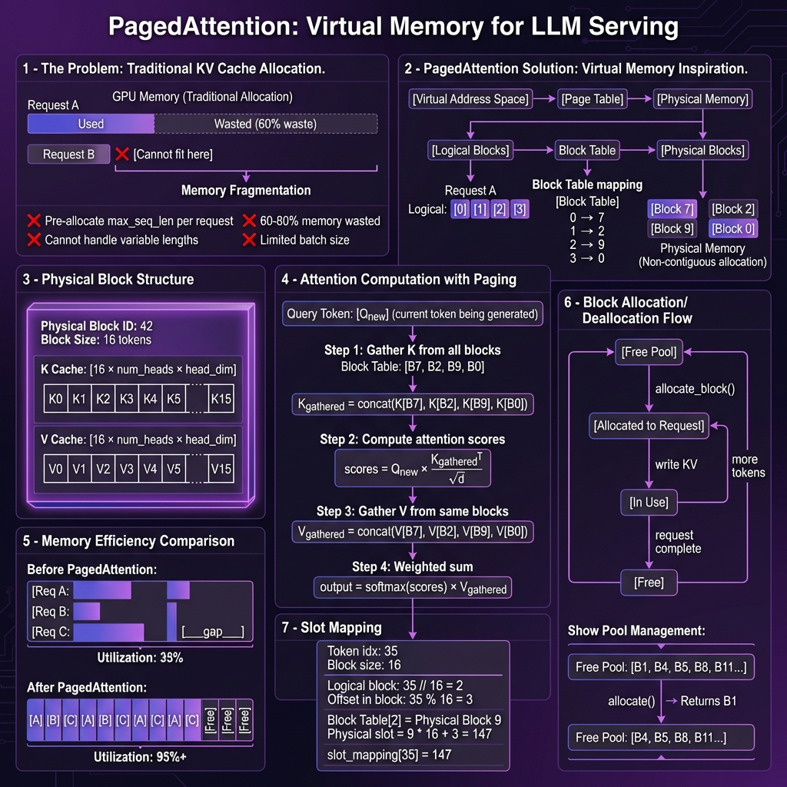
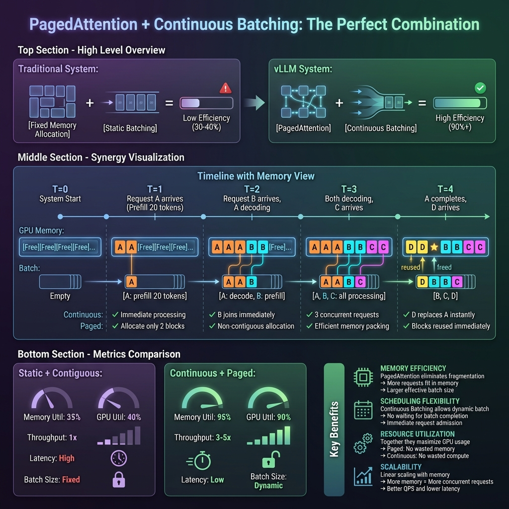

## 📋 概述

**PagedAttention** 和 **Continuous Batching** 是 vLLM 实现高性能 LLM 推理的两大核心技术。它们共同解决了传统推理系统中的内存效率和吞吐量问题。

| 技术 | 解决的问题 | 效果 |
|------|-----------|------|
| **PagedAttention** | 内存碎片化、内存浪费 | 内存利用率从 35% 提升到 95%+ |
| **Continuous Batching** | GPU 利用率低、延迟高 | 吞吐量提升 3-5 倍 |

---

## 🟣 Part 1: PagedAttention

### 1.1 传统方案的问题

传统 LLM 推理系统为每个请求预分配固定大小的连续内存：

```
传统内存分配：
┌──────────────────────────────────────────────────────────────┐
│ Request A: [████████████____________________________]        │
│            实际使用 40%    预留但未使用 60%                    │
├──────────────────────────────────────────────────────────────┤
│ Request B: [██████__________] ← 短请求浪费更严重              │
├──────────────────────────────────────────────────────────────┤
│ Request C: 无法分配！内存碎片化导致空间不足                     │
└──────────────────────────────────────────────────────────────┘
```

**核心问题**：

| 问题 | 说明 |
|------|------|
| 🔴 预分配浪费 | 每个请求预留 `max_seq_len` 大小的内存 |
| 🔴 内存碎片化 | 不连续的小空间无法利用 |
| 🔴 批大小受限 | 内存浪费导致并发请求数减少 |
| 🔴 不可预测 | 无法预知每个请求的实际长度 |

### 1.2 PagedAttention 解决方案

PagedAttention 借鉴了操作系统的**虚拟内存分页**机制：



**核心思想**：将 KV Cache 切分为固定大小的**块（Block）**，按需动态分配。

```
操作系统虚拟内存:
[虚拟地址空间] → [页表] → [物理内存页]

PagedAttention:
[逻辑块索引] → [块表 Block Table] → [物理块]
```

### 1.3 块（Block）结构

每个物理块存储固定数量的 token 的 KV 向量：

```python
class PhysicalBlock:
    """物理块结构"""
    
    block_id: int           # 唯一标识符
    block_size: int = 16    # 每块存储的 token 数
    
    # KV Cache 存储
    k_cache: Tensor  # shape: [block_size, num_heads, head_dim]
    v_cache: Tensor  # shape: [block_size, num_heads, head_dim]
    
    # 元信息
    num_tokens: int  # 当前已填充的 token 数 (0 ~ block_size)
    ref_count: int   # 引用计数 (用于前缀缓存共享)
```

**内存布局**：

```
物理块 42 (block_size=16):
┌─────────────────────────────────────────────────┐
│ K Cache:                                        │
│ ┌────┬────┬────┬────┬────┬────┬...┬────┐       │
│ │ K₀ │ K₁ │ K₂ │ K₃ │ K₄ │ K₅ │   │K₁₅│       │
│ └────┴────┴────┴────┴────┴────┴...┴────┘       │
├─────────────────────────────────────────────────┤
│ V Cache:                                        │
│ ┌────┬────┬────┬────┬────┬────┬...┬────┐       │
│ │ V₀ │ V₁ │ V₂ │ V₃ │ V₄ │ V₅ │   │V₁₅│       │
│ └────┴────┴────┴────┴────┴────┴...┴────┘       │
└─────────────────────────────────────────────────┘
每个 K/V 向量大小: num_heads × head_dim
```

### 1.4 块表（Block Table）映射

每个请求维护一个块表，记录逻辑块到物理块的映射：

```python
class BlockTable:
    """
    逻辑块 → 物理块的映射
    
    Request A 的块表:
    逻辑索引:  [0] → [1] → [2] → [3]
                ↓     ↓     ↓     ↓
    物理块 ID: [7]   [2]   [9]   [0]
    
    物理块可以是不连续的！
    """
    
    def __init__(self):
        self.mapping: List[int] = []
    
    def get_physical_block(self, logical_idx: int) -> int:
        return self.mapping[logical_idx]
    
    def append_block(self, physical_block_id: int):
        self.mapping.append(physical_block_id)
```

### 1.5 Slot Mapping（槽位映射）

Token 位置到物理内存位置的计算：

```python
def compute_slot_mapping(token_position: int, 
                         block_table: List[int],
                         block_size: int = 16) -> int:
    """
    计算 token 在物理内存中的位置
    
    示例: token_position = 35, block_size = 16
    """
    # 1. 计算逻辑块索引
    logical_block_idx = token_position // block_size  # 35 // 16 = 2
    
    # 2. 计算块内偏移
    offset_in_block = token_position % block_size     # 35 % 16 = 3
    
    # 3. 查询物理块 ID
    physical_block_id = block_table[logical_block_idx]  # block_table[2] = 9
    
    # 4. 计算物理槽位
    physical_slot = physical_block_id * block_size + offset_in_block
    # physical_slot = 9 * 16 + 3 = 147
    
    return physical_slot  # 147
```

### 1.6 分页式注意力计算

使用分页 KV Cache 的注意力计算步骤：

```python
def paged_attention(query: Tensor,           # [1, num_heads, head_dim]
                    kv_cache: Tensor,         # [num_blocks, block_size, num_heads, head_dim]
                    block_table: List[int],   # 块映射表
                    seq_len: int) -> Tensor:
    """
    分页式注意力计算
    """
    # Step 1: 从非连续的物理块中收集 K 向量
    k_gathered = []
    for logical_idx, physical_block in enumerate(block_table):
        k_gathered.append(kv_cache[physical_block, :, 0, :])  # 取 K
    k_all = torch.cat(k_gathered, dim=0)[:seq_len]  # [seq_len, num_heads, head_dim]
    
    # Step 2: 计算注意力分数
    # scores = Q × K^T / √d
    scores = torch.matmul(query, k_all.transpose(-1, -2)) / math.sqrt(head_dim)
    
    # Step 3: Softmax
    attention_weights = torch.softmax(scores, dim=-1)
    
    # Step 4: 从物理块中收集 V 向量
    v_gathered = []
    for physical_block in block_table:
        v_gathered.append(kv_cache[physical_block, :, 1, :])  # 取 V
    v_all = torch.cat(v_gathered, dim=0)[:seq_len]
    
    # Step 5: 加权求和
    output = torch.matmul(attention_weights, v_all)
    
    return output
```

### 1.7 内存效率对比


| 指标 | 传统方案 | PagedAttention |
|------|----------|----------------|
| 内存利用率 | 30-40% | 90-95% |
| 内存碎片 | 严重 | 几乎没有 |
| 最大批大小 | 受限 | 提升 2-4 倍 |
| 长短请求混合 | 效率低 | 高效 |

---

## 🟢 Part 2: Continuous Batching

### 2.1 静态批处理的问题

传统静态批处理需要等待整个批次完成：

```
静态批处理 (Static Batching):
                    时间 →
Batch 1: ├────────────────────────────────────────────┤
         │ Request A: 生成 100 tokens                 │ ← 最长请求
         │ Request B: 生成 30 tokens ████████▒▒▒▒▒▒▒▒▒│ ← 等待 A
         │ Request C: 生成 50 tokens ████████████████▒▒│ ← 等待 A
         └─── 整个 Batch 等待最长请求完成 ────────────┘
         
              ↓ Batch 1 完成后才开始 Batch 2
              
Batch 2: ├────────────────────────────────────┤
         │ Request D, E, F...                 │
         └────────────────────────────────────┘
```

**问题**：
- ❌ 短请求被长请求阻塞
- ❌ GPU 在等待时空闲
- ❌ 平均延迟高
- ❌ 吞吐量低

### 2.2 Continuous Batching 解决方案

Continuous Batching 允许请求在**迭代级别**动态加入和离开：


```
连续批处理 (Continuous Batching):
                    时间 →
Request A: ├──────────────────────────────────────────────────┤
Request B: ├──────────────────┤ → 完成，立即离开
Request C: ├────────────────────────────┤ → 完成
Request D:           ├← 加入 ───────────────────────────────┤
Request E:                    ├← 加入 ──────────────────────┤
Request F:                              ├← 加入 ────────────┤

特点:
✅ 请求随时加入
✅ 请求完成后立即离开
✅ GPU 始终满载
✅ 低延迟 + 高吞吐
```

### 2.3 迭代级调度

每次模型前向传播（iteration）都可以调整批次组成：

```python
class Scheduler:
    """
    迭代级调度器
    """
    
    def __init__(self):
        self.waiting_queue: Deque[Request] = deque()  # 等待队列
        self.running_queue: Dict[str, Request] = {}   # 运行中请求
    
    def schedule(self) -> SchedulerOutput:
        """
        每次迭代调用一次
        """
        # 1. 处理已完成的请求
        finished = []
        for req_id, req in self.running_queue.items():
            if req.is_finished():
                finished.append(req_id)
                self.kv_cache_manager.free(req)  # 释放 KV Cache
        
        for req_id in finished:
            del self.running_queue[req_id]
        
        # 2. 尝试接纳新请求
        while self.waiting_queue and self.has_memory():
            new_req = self.waiting_queue.popleft()
            blocks = self.kv_cache_manager.allocate(new_req)
            self.running_queue[new_req.id] = new_req
        
        # 3. 构建本次迭代的批次
        batch = []
        for req in self.running_queue.values():
            if req.is_prefill:
                batch.append(ScheduledRequest(req, num_tokens=len(req.prompt)))
            else:
                batch.append(ScheduledRequest(req, num_tokens=1))
        
        return SchedulerOutput(scheduled_requests=batch)
```

### 2.4 Prefill vs Decode 阶段

LLM 推理有两个不同特性的阶段：

```
┌─────────────────────────────────────────────────────────────┐
│                    Prefill 阶段                              │
├─────────────────────────────────────────────────────────────┤
│ 输入: "What is machine learning?" (5 tokens)                │
│                                                             │
│ 处理: 并行计算所有 5 个 token                                │
│       [T1, T2, T3, T4, T5] ──→ [Model] ──→ [K, V Cache]    │
│                                                             │
│ 特点:                                                       │
│   • Compute-bound (计算密集)                                 │
│   • 高 GPU 利用率                                            │
│   • 一次性处理多个 token                                     │
└─────────────────────────────────────────────────────────────┘
                              ↓
┌─────────────────────────────────────────────────────────────┐
│                    Decode 阶段                               │
├─────────────────────────────────────────────────────────────┤
│ 生成: 逐个生成 token (自回归)                                 │
│                                                             │
│ Step 1: [KV Cache] + new_query ──→ token_6                 │
│ Step 2: [KV Cache + K6,V6] + query ──→ token_7             │
│ Step 3: [KV Cache + K6,V6,K7,V7] ──→ token_8               │
│ ...                                                         │
│                                                             │
│ 特点:                                                       │
│   • Memory-bound (内存密集)                                  │
│   • 每步只生成 1 个 token                                    │
│   • 主要时间在读取 KV Cache                                  │
└─────────────────────────────────────────────────────────────┘
```

**混合批处理**：Continuous Batching 可以同时处理 Prefill 和 Decode：

```
混合批次示例:
┌─────────────────────────────────────────────┐
│ Iteration 5:                                │
│   • Request A: decode (1 token)            │
│   • Request B: decode (1 token)            │
│   • Request C: prefill (50 tokens) ← NEW   │
│   • Request D: prefill (30 tokens) ← NEW   │
│                                             │
│ Total tokens: 82                            │
│ Batch size: 4 requests                      │
└─────────────────────────────────────────────┘
```

### 2.5 Chunked Prefill（分块预填充）

对于长 Prompt，分块处理避免阻塞其他请求：

```
原始 Prompt: 2048 tokens
            ↓ 分块
┌─────────────────────────────────────────────────────────────┐
│ Chunk 1: 512 tokens                                         │
│ Chunk 2: 512 tokens                                         │
│ Chunk 3: 512 tokens                                         │
│ Chunk 4: 512 tokens                                         │
└─────────────────────────────────────────────────────────────┘

交错处理:
│Chunk 1│Decode A,B│Chunk 2│Decode A,B│Chunk 3│Decode A,B│Chunk 4│
                                                              ↓
                                            长 prompt 不阻塞其他请求
```

**配置参数**：

```python
# vLLM 配置
scheduler_config = SchedulerConfig(
    max_num_batched_tokens=2048,   # 每次迭代最大 token 数
    max_num_seqs=256,              # 最大并发请求数
    max_model_len=32768,           # 最大序列长度
    enable_chunked_prefill=True,   # 启用分块预填充
    max_prefill_tokens=512,        # 每块最大 token 数
)
```

### 2.6 调度器输出结构

```python
@dataclass
class SchedulerOutput:
    """调度器输出"""
    
    # 本次迭代要处理的请求
    scheduled_requests: List[ScheduledRequest]
    
    # 每个请求的信息
    # ScheduledRequest:
    #   - request_id: str
    #   - num_tokens: int          # 本次处理的 token 数
    #   - is_prefill: bool         # 是否是 prefill 阶段
    #   - block_table: List[int]   # KV Cache 块表
    
    # 已完成的请求 ID
    finished_request_ids: List[str]
    
    # 被抢占的请求 (内存不足时)
    preempted_request_ids: List[str]
    
    # 统计信息
    total_num_scheduled_tokens: int
    num_prefill_requests: int
    num_decode_requests: int
```

---

## 🔵 Part 3: 两者如何协同工作

PagedAttention 和 Continuous Batching 相互增强，形成完美组合：



### 3.1 协同效应

```
┌─────────────────────────────────────────────────────────────┐
│                    协同效应                                  │
├─────────────────────────────────────────────────────────────┤
│                                                             │
│  PagedAttention                  Continuous Batching        │
│       │                               │                     │
│       ▼                               ▼                     │
│  消除内存碎片  ───────────────→  更多请求进入批次            │
│       │                               │                     │
│       ▼                               ▼                     │
│  按需分配内存  ←───────────────  请求动态加入/离开           │
│       │                               │                     │
│       ▼                               ▼                     │
│  即时释放块    ───────────────→  新请求立即复用              │
│       │                               │                     │
│       └───────────────┬───────────────┘                     │
│                       ▼                                     │
│              GPU 利用率最大化                                │
│              (内存 95% + 计算 90%)                           │
│                                                             │
└─────────────────────────────────────────────────────────────┘
```

### 3.2 时间线示例

```
时间线展示两者协同:

T=0: 系统启动
     GPU Memory: [Free][Free][Free][Free][Free][Free][Free][Free]
     Batch: []

T=1: Request A 到达 (Prefill 20 tokens)
     GPU Memory: [A][A][Free][Free][Free][Free][Free][Free]
                 ↑ PagedAttention: 只分配需要的 2 块
     Batch: [A: prefill]
            ↑ Continuous: 立即开始处理

T=2: A 在解码，Request B 到达
     GPU Memory: [A][A][A][B][B][B][Free][Free]
                       ↑    ↑ B 的块可以不连续
     Batch: [A: decode, B: prefill]
            ↑ Continuous: B 立即加入批次

T=3: A, B 都在解码，Request C 到达
     GPU Memory: [A][A][A][B][B][B][C][C]
     Batch: [A, B, C: all decode/prefill]
            ↑ Continuous: 3 个请求并发

T=4: Request A 完成
     GPU Memory: [★][★][★][B][B][B][C][C]
                 ↑ 立即释放  ↑ 继续使用
     Batch: [B, C]
            ↑ A 离开，腾出资源

T=5: Request D 复用 A 的块
     GPU Memory: [D][D][Free][B][B][B][C][C]
                 ↑ 复用块     ↑ 有空闲块
     Batch: [B, C, D]
            ↑ D 立即加入
```

### 3.3 性能对比

| 指标 | 静态批处理 + 连续内存 | Continuous + Paged |
|------|----------------------|-------------------|
| 内存利用率 | 30-40% | **95%+** |
| GPU 计算利用率 | 40-50% | **90%+** |
| 吞吐量 | 1x (基准) | **3-5x** |
| 平均延迟 | 高 | **低** |
| P99 延迟 | 非常高 | **可控** |
| 批大小 | 固定 | **动态** |
| 长短请求混合 | 效率低 | **高效** |

---

## 📝 Part 4: 实现细节

### 4.1 核心代码位置

| 模块 | 文件路径 | 说明 |
|------|----------|------|
| **Scheduler** | `vllm/v1/core/sched/scheduler.py` | 调度器核心 (99KB) |
| **KVCacheManager** | `vllm/v1/core/kv_cache_manager.py` | KV 缓存管理 |
| **BlockPool** | `vllm/v1/core/block_pool.py` | 块池管理 |
| **BlockTable** | `vllm/v1/worker/block_table.py` | 块表实现 |
| **GPUModelRunner** | `vllm/v1/worker/gpu_model_runner.py` | 模型执行 (6000+ 行) |

### 4.2 关键配置参数

```python
from vllm import LLM, SamplingParams

llm = LLM(
    model="meta-llama/Llama-2-7b-hf",
    
    # PagedAttention 相关
    block_size=16,              # 每块 token 数
    gpu_memory_utilization=0.9, # GPU 内存使用比例
    
    # Continuous Batching 相关
    max_num_seqs=256,           # 最大并发请求数
    max_num_batched_tokens=8192, # 每次迭代最大 token 数
    
    # Chunked Prefill
    enable_chunked_prefill=True,
    max_num_partial_prefills=1,
)
```

### 4.3 监控指标

```python
# 关键监控指标
metrics = {
    # PagedAttention 相关
    "kv_cache_usage": 0.85,          # KV Cache 使用率
    "num_free_blocks": 1024,         # 空闲块数量
    "num_allocated_blocks": 5120,    # 已分配块数量
    
    # Continuous Batching 相关
    "num_running_requests": 64,      # 运行中请求数
    "num_waiting_requests": 128,     # 等待中请求数
    "batch_size": 64,                # 当前批大小
    "tokens_per_second": 10000,      # 吞吐量 (tokens/s)
    
    # 延迟相关
    "avg_prefill_latency_ms": 50,    # 平均 prefill 延迟
    "avg_decode_latency_ms": 10,     # 平均 decode 延迟
    "avg_e2e_latency_ms": 500,       # 平均端到端延迟
}
```

---

## 📚 参考资料

- [Efficient Memory Management for Large Language Model Serving with PagedAttention](https://arxiv.org/abs/2309.06180)
- [ORCA: A Distributed Serving System for Transformer-Based Generative Models](https://www.usenix.org/conference/osdi22/presentation/yu)
- [vLLM 官方文档](https://docs.vllm.ai/)

---

## 🎯 总结

| 技术 | 核心思想 | 关键效果 |
|------|----------|----------|
| **PagedAttention** | 借鉴 OS 虚拟内存分页 | 消除碎片，提升内存利用率 |
| **Continuous Batching** | 迭代级动态调度 | 最大化 GPU 利用率 |
| **两者结合** | 内存 + 计算双优化 | 3-5x 吞吐量提升 |

这两项技术的结合使 vLLM 成为当前最高效的开源 LLM 推理引擎。
