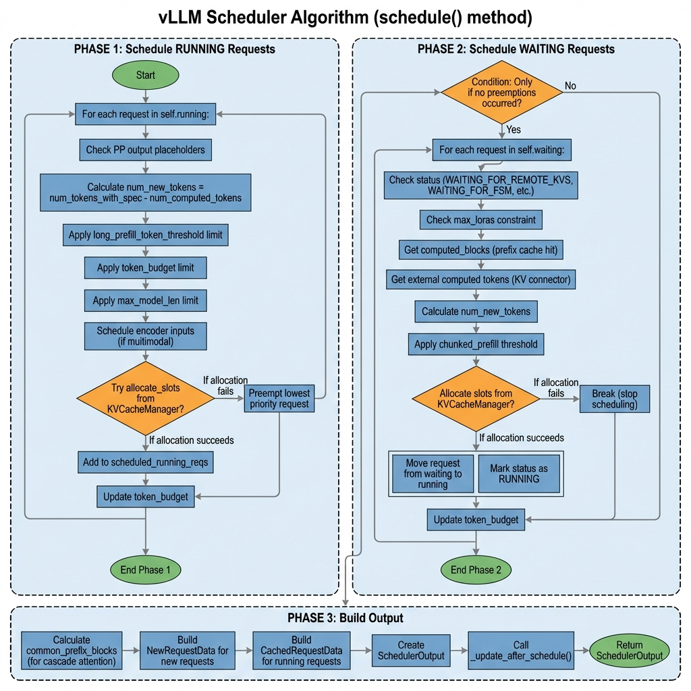
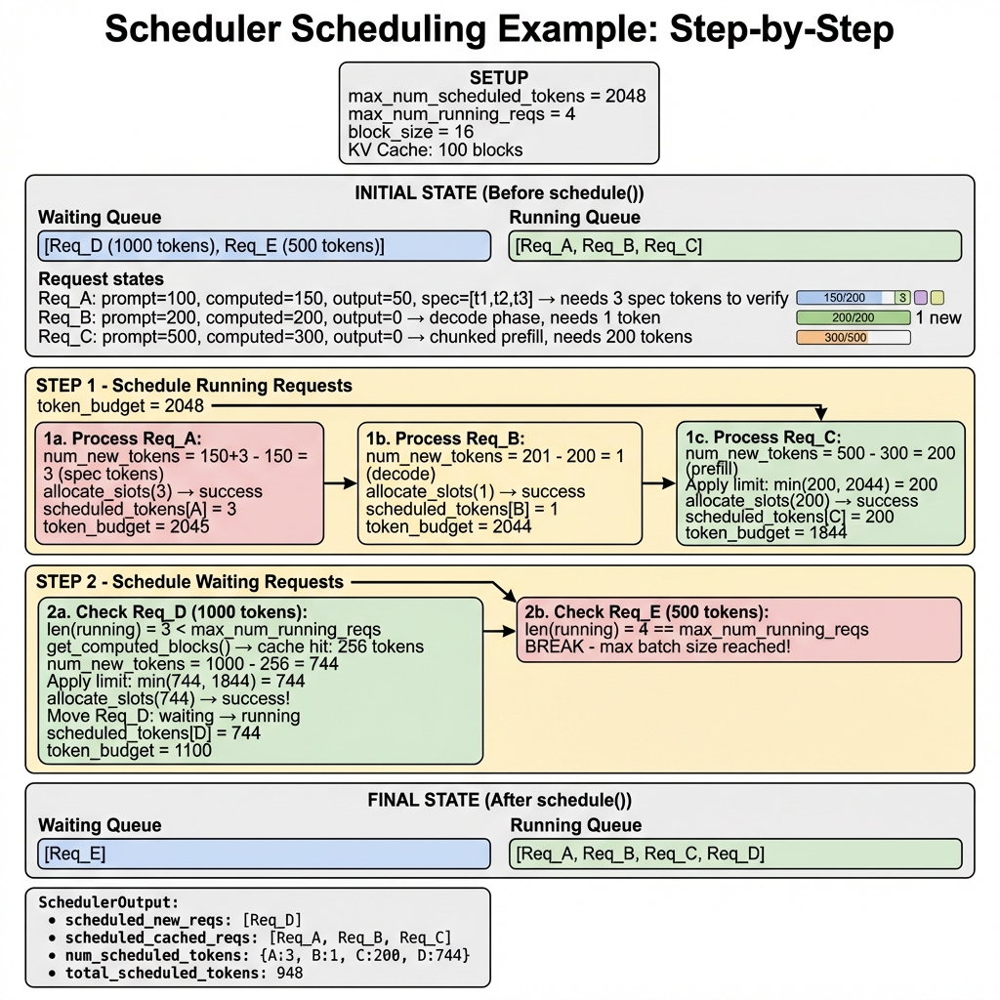

> 本文档深入分析 vLLM V1 的调度器（Scheduler）算法，包括架构设计、调度策略、抢占机制和完整示例。

## 目录

1. [Scheduler 概述](#scheduler-概述)
2. [核心架构](#核心架构)
3. [调度算法详解](#调度算法详解)
4. [抢占机制](#抢占机制)
5. [请求状态管理](#请求状态管理)
6. [完整调度示例](#完整调度示例)
7. [性能优化与最佳实践](#性能优化与最佳实践)

---

## Scheduler 概述

### 什么是 Scheduler？

**Scheduler** 是 vLLM 的核心组件之一，负责决定每一步（step）应该处理哪些请求以及处理多少 token。它需要在以下约束条件下做出最优决策：

1. **Token 预算**：每步最多处理的 token 数量
2. **批次大小**：同时运行的最大请求数
3. **KV Cache 容量**：可用的 KV 缓存块数量
4. **上下文长度**：最大模型长度限制
5. **LoRA 约束**：同时使用的最大 LoRA 适配器数量

### 关键特性

| 特性 | 说明 |
|------|------|
| Continuous Batching | 请求可以随时加入/离开批次 |
| Chunked Prefill | 长 prompt 分块处理 |
| Prefix Caching | 复用已计算的 KV Cache |
| Preemption | 资源不足时抢占低优先级请求 |
| Speculative Decoding | 支持推测解码调度 |
| KV Transfer | 支持 P/D 分离架构 |


---

## 核心架构

### 类结构

```
vllm/v1/core/sched/
├── scheduler.py        # 主 Scheduler 类 (2127 行)
├── request_queue.py    # 请求队列实现
├── interface.py        # Scheduler 接口定义
├── output.py           # SchedulerOutput 数据类
├── async_scheduler.py  # 异步调度器
└── utils.py            # 工具函数
```

### Scheduler 初始化

```python
class Scheduler(SchedulerInterface):
    def __init__(
        self,
        vllm_config: VllmConfig,
        kv_cache_config: KVCacheConfig,
        structured_output_manager: StructuredOutputManager,
        block_size: int,
        mm_registry: MultiModalRegistry = MULTIMODAL_REGISTRY,
        include_finished_set: bool = False,
        log_stats: bool = False,
    ) -> None:
        # 调度约束
        self.max_num_running_reqs = scheduler_config.max_num_seqs
        self.max_num_scheduled_tokens = scheduler_config.max_num_batched_tokens
        self.max_model_len = model_config.max_model_len
        
        # 请求管理
        self.requests: dict[str, Request] = {}  # 所有活跃请求
        self.waiting = create_request_queue(self.policy)  # 等待队列
        self.running: list[Request] = []  # 运行队列
        self.finished_req_ids: set[str] = set()  # 已完成请求
        
        # 核心组件
        self.kv_cache_manager = KVCacheManager(...)
        self.encoder_cache_manager = EncoderCacheManager(...)
        
        # 可选组件
        self.connector = KVConnector(...)  # P/D 分离
        self.ec_connector = ECConnector(...)  # 编码器缓存连接器
```

### 调度约束参数

| 参数 | 类型 | 说明 |
|------|------|------|
| `max_num_running_reqs` | int | 最大同时运行请求数 (batch size) |
| `max_num_scheduled_tokens` | int | 每步最大调度 token 数 |
| `max_model_len` | int | 最大上下文长度 |
| `max_num_encoder_input_tokens` | int | 多模态编码器预算 |
| `long_prefill_token_threshold` | int | 长 prefill 分块阈值 |

### 调度策略

vLLM 支持两种调度策略：

#### 1. FCFS (First-Come-First-Served) - 默认

```python
class FCFSRequestQueue(deque[Request], RequestQueue):
    def add_request(self, request: Request) -> None:
        self.append(request)  # 添加到队尾
    
    def pop_request(self) -> Request:
        return self.popleft()  # 从队首取出
    
    def peek_request(self) -> Request:
        return self[0]  # 查看队首
```

**特点**：
- 按到达顺序处理
- 实现简单，O(1) 操作
- 公平但不支持优先级

#### 2. PRIORITY (优先级调度)

```python
class PriorityRequestQueue(RequestQueue):
    def __init__(self) -> None:
        self._heap: list[Request] = []
    
    def add_request(self, request: Request) -> None:
        heapq.heappush(self._heap, request)
    
    def pop_request(self) -> Request:
        return heapq.heappop(self._heap)
    
    # 排序键: (priority, arrival_time)
    # priority 值越小优先级越高
```

**特点**：
- 按 `(priority, arrival_time)` 排序
- 支持动态优先级调整
- O(log n) 操作

---

## 调度算法详解



### schedule() 方法概览

```python
def schedule(self) -> SchedulerOutput:
    """主调度方法，每个 step 调用一次"""
    
    # 初始化
    scheduled_new_reqs: list[Request] = []
    scheduled_resumed_reqs: list[Request] = []
    scheduled_running_reqs: list[Request] = []
    preempted_reqs: list[Request] = []
    
    req_to_new_blocks: dict[str, KVCacheBlocks] = {}
    num_scheduled_tokens: dict[str, int] = {}
    token_budget = self.max_num_scheduled_tokens
    
    # Phase 1: 调度 RUNNING 请求
    # Phase 2: 调度 WAITING 请求
    # Phase 3: 构建输出
    
    return scheduler_output
```

### Phase 1: 调度 RUNNING 请求

优先处理已在运行的请求，确保它们能继续执行：

```python
# Phase 1: 调度 RUNNING 请求
req_index = 0
while req_index < len(self.running) and token_budget > 0:
    request = self.running[req_index]
    
    # Step 1: 计算需要调度的 token 数
    num_new_tokens = (
        request.num_tokens_with_spec    # 总 token (包括 spec tokens)
        + request.num_output_placeholders  # PP 占位符
        - request.num_computed_tokens   # 已计算的 token
    )
    
    # Step 2: 应用各种限制
    # 2a. 长 prefill 分块限制
    if 0 < long_prefill_threshold < num_new_tokens:
        num_new_tokens = long_prefill_threshold
    
    # 2b. Token 预算限制
    num_new_tokens = min(num_new_tokens, token_budget)
    
    # 2c. 最大模型长度限制
    num_new_tokens = min(
        num_new_tokens, 
        self.max_model_len - 1 - request.num_computed_tokens
    )
    
    # Step 3: 调度编码器输入 (多模态)
    if request.has_encoder_inputs:
        encoder_inputs_to_schedule, num_new_tokens, ... = (
            self._try_schedule_encoder_inputs(...)
        )
    
    # Step 4: 分配 KV Cache 块
    while True:
        new_blocks = self.kv_cache_manager.allocate_slots(
            request, num_new_tokens, 
            num_lookahead_tokens=self.num_lookahead_tokens
        )
        
        if new_blocks is not None:
            break  # 分配成功
        
        # 分配失败 -> 抢占低优先级请求
        preempted_req = self._select_victim_for_preemption()
        self._preempt_request(preempted_req, timestamp)
        preempted_reqs.append(preempted_req)
    
    # Step 5: 记录调度结果
    if new_blocks is not None:
        scheduled_running_reqs.append(request)
        req_to_new_blocks[request.request_id] = new_blocks
        num_scheduled_tokens[request.request_id] = num_new_tokens
        token_budget -= num_new_tokens
```

### Phase 2: 调度 WAITING 请求

只有在没有抢占发生时才调度新请求：

```python
# Phase 2: 调度 WAITING 请求
if not preempted_reqs:  # 仅当无抢占时
    while self.waiting and token_budget > 0:
        # 检查批次大小限制
        if len(self.running) == self.max_num_running_reqs:
            break
        
        request = self.waiting.peek_request()
        
        # Step 1: 检查特殊状态
        if request.status == RequestStatus.WAITING_FOR_REMOTE_KVS:
            # KV 传输中，跳过
            continue
        if request.status == RequestStatus.WAITING_FOR_FSM:
            # 结构化输出编译中，跳过
            continue
        if request.status == RequestStatus.WAITING_FOR_STREAMING_REQ:
            # 等待流式输入，跳过
            continue
        
        # Step 2: 检查 LoRA 约束
        if (lora_config and 
            len(scheduled_loras) == max_loras and
            request.lora_id not in scheduled_loras):
            continue
        
        # Step 3: 获取已缓存的 token (Prefix Caching)
        new_computed_blocks, num_local_cached = (
            self.kv_cache_manager.get_computed_blocks(request)
        )
        
        # Step 4: 获取外部缓存的 token (KV Connector)
        if self.connector is not None:
            num_external_cached, load_async = (
                self.connector.get_num_new_matched_tokens(...)
            )
        
        # Step 5: 计算需要处理的 token 数
        num_computed_tokens = num_local_cached + num_external_cached
        num_new_tokens = request.num_tokens - num_computed_tokens
        
        # Step 6: 应用 Chunked Prefill 限制
        if not enable_chunked_prefill and num_new_tokens > token_budget:
            break  # 禁用分块时，预算不足则停止
        num_new_tokens = min(num_new_tokens, token_budget)
        
        # Step 7: 分配 KV Cache 块
        new_blocks = self.kv_cache_manager.allocate_slots(
            request, num_new_tokens,
            num_new_computed_tokens=num_local_cached,
            new_computed_blocks=new_computed_blocks,
            num_external_computed_tokens=num_external_cached,
        )
        
        if new_blocks is None:
            break  # 分配失败，停止调度新请求
        
        # Step 8: 移动请求到运行队列
        request = self.waiting.pop_request()
        self.running.append(request)
        request.status = RequestStatus.RUNNING
        request.num_computed_tokens = num_computed_tokens
        
        # 记录结果
        if request.status == RequestStatus.WAITING:
            scheduled_new_reqs.append(request)
        elif request.status == RequestStatus.PREEMPTED:
            scheduled_resumed_reqs.append(request)
```

### Phase 3: 构建 SchedulerOutput

```python
# Phase 3: 构建输出
# Step 1: 计算公共前缀块 (用于 Cascade Attention)
num_common_prefix_blocks = self.kv_cache_manager.get_num_common_prefix_blocks(
    any_request.request_id
)

# Step 2: 构建新请求数据
new_reqs_data = [
    NewRequestData.from_request(
        req,
        req_to_new_blocks[req.request_id].get_block_ids(),
    )
    for req in scheduled_new_reqs
]

# Step 3: 构建缓存请求数据
cached_reqs_data = self._make_cached_request_data(
    scheduled_running_reqs,
    scheduled_resumed_reqs,
    num_scheduled_tokens,
    spec_decode_tokens,
    req_to_new_blocks,
)

# Step 4: 创建 SchedulerOutput
scheduler_output = SchedulerOutput(
    scheduled_new_reqs=new_reqs_data,
    scheduled_cached_reqs=cached_reqs_data,
    num_scheduled_tokens=num_scheduled_tokens,
    total_num_scheduled_tokens=sum(num_scheduled_tokens.values()),
    preempted_req_ids={req.request_id for req in preempted_reqs},
    finished_req_ids=self.finished_req_ids,
    num_common_prefix_blocks=num_common_prefix_blocks,
)

# Step 5: 更新状态
self._update_after_schedule(scheduler_output)

return scheduler_output
```

---

## 抢占机制


### 何时发生抢占？

当 **KV Cache 分配失败** 时，调度器需要抢占低优先级请求来释放资源：

```python
new_blocks = self.kv_cache_manager.allocate_slots(request, num_new_tokens)
if new_blocks is None:
    # 分配失败 -> 需要抢占
    ...
```

### 抢占策略

根据调度策略选择不同的抢占目标：

```python
# FCFS 策略: 抢占最后加入的请求
if self.policy == SchedulingPolicy.FCFS:
    preempted_req = self.running.pop()  # O(1)

# PRIORITY 策略: 抢占优先级最低的请求
elif self.policy == SchedulingPolicy.PRIORITY:
    preempted_req = max(
        self.running,
        key=lambda r: (r.priority, r.arrival_time)
    )
    self.running.remove(preempted_req)  # O(n)
```

### 抢占过程

```python
def _preempt_request(self, request: Request, timestamp: float) -> None:
    """抢占请求并放回等待队列"""
    assert request.status == RequestStatus.RUNNING
    
    # 1. 释放 KV Cache 块
    self.kv_cache_manager.free(request)
    
    # 2. 释放编码器缓存
    self.encoder_cache_manager.free(request)
    
    # 3. 重置状态
    request.status = RequestStatus.PREEMPTED
    request.num_computed_tokens = 0
    request.spec_token_ids.clear()
    request.num_preemptions += 1
    
    # 4. 记录事件
    if self.log_stats:
        request.record_event(EngineCoreEventType.PREEMPTED, timestamp)
    
    # 5. 放回等待队列头部
    self.waiting.prepend_request(request)
```

### 抢占循环

持续抢占直到分配成功或无法继续：

```python
while True:
    new_blocks = self.kv_cache_manager.allocate_slots(request, num_new_tokens)
    
    if new_blocks is not None:
        break  # 分配成功
    
    # 选择并抢占受害者
    preempted_req = self._select_victim()
    self._preempt_request(preempted_req)
    preempted_reqs.append(preempted_req)
    
    if preempted_req == request:
        # 当前请求也被抢占，无法调度
        break
```

---

## 请求状态管理

### 请求状态枚举

```python
class RequestStatus(Enum):
    # 正常状态
    WAITING = "waiting"                     # 等待调度
    RUNNING = "running"                     # 正在执行
    PREEMPTED = "preempted"                 # 被抢占
    
    # 完成状态
    FINISHED_STOPPED = "finished_stopped"   # 正常完成
    FINISHED_LENGTH_CAPPED = "finished_length_capped"  # 达到长度限制
    FINISHED_ABORTED = "finished_aborted"   # 被中止
    FINISHED_IGNORED = "finished_ignored"   # 被忽略
    
    # 特殊等待状态
    WAITING_FOR_REMOTE_KVS = "waiting_for_remote_kvs"  # 等待远程 KV
    WAITING_FOR_FSM = "waiting_for_fsm"               # 等待 FSM 编译
    WAITING_FOR_STREAMING_REQ = "waiting_for_streaming_req"  # 等待流式输入
```

### 状态转换图

```
NEW ─────────────────────────────────────────────────┐
    │                                                │
    ▼                                                │
WAITING ──────────────────────────────────────┐      │
    │         ▲                               │      │
    │         │ prepend                       │      │
    │         │                               │      │
    ▼         │                               │      │
RUNNING ─────►│ PREEMPTED                     │      │
    │         │                               │      │
    │         │                               │      │
    │         ├─── WAITING_FOR_REMOTE_KVS ────┤      │
    │         │                               │      │
    │         ├─── WAITING_FOR_FSM ───────────┤      │
    │         │                               │      │
    │         └─── WAITING_FOR_STREAMING_REQ ─┘      │
    │                                                │
    ▼                                                │
FINISHED_* ◄─────────────────────────────────────────┘
```

### update_from_output() 方法

处理模型输出并更新请求状态：

```python
def update_from_output(
    self,
    scheduler_output: SchedulerOutput,
    model_runner_output: ModelRunnerOutput,
) -> dict[int, EngineCoreOutputs]:
    """处理模型输出，更新请求状态"""
    
    sampled_token_ids = model_runner_output.sampled_token_ids
    
    for req_id, num_tokens_scheduled in num_scheduled_tokens.items():
        request = self.requests.get(req_id)
        if request is None:
            continue  # 请求已被中止
        
        req_index = model_runner_output.req_id_to_index[req_id]
        new_token_ids = sampled_token_ids[req_index]
        
        # 处理 Speculative Decoding 结果
        if scheduled_spec_token_ids:
            num_accepted = len(new_token_ids) - 1
            num_rejected = num_draft_tokens - num_accepted
            request.num_computed_tokens -= num_rejected
        
        # 检查停止条件
        if new_token_ids:
            new_token_ids, stopped = self._update_request_with_output(
                request, new_token_ids
            )
        
        # 处理停止的请求
        if stopped:
            finished = self._handle_stopped_request(request)
            if finished:
                self._free_request(request)
```

---

## 完整调度示例



### 场景描述

假设我们有以下配置：
- `max_num_scheduled_tokens = 2048`
- `max_num_running_reqs = 4`
- `block_size = 16`
- KV Cache: 100 blocks

### 初始状态

```python
# 等待队列
waiting = [
    Req_D(prompt_tokens=1000),
    Req_E(prompt_tokens=500),
]

# 运行队列
running = [
    Req_A(prompt=100, computed=150, output=50, spec=[t1,t2,t3]),
    Req_B(prompt=200, computed=200, output=0),
    Req_C(prompt=500, computed=300, output=0),
]
```

请求状态分析：
- **Req_A**: 已完成 150 tokens，有 50 个输出，正在验证 3 个推测 token
- **Req_B**: Prefill 完成，进入 decode 阶段，需要生成 1 个 token
- **Req_C**: Chunked prefill 中，还需处理 200 tokens

### Step 1: 调度 RUNNING 请求

```python
token_budget = 2048

# 1a. 处理 Req_A (Speculative Decoding)
num_new_tokens = 153 - 150 = 3  # 3 个 spec tokens
allocate_slots(3) → success
scheduled_tokens[A] = 3
token_budget = 2045

# 1b. 处理 Req_B (Decode)
num_new_tokens = 201 - 200 = 1  # 1 个 decode token
allocate_slots(1) → success
scheduled_tokens[B] = 1
token_budget = 2044

# 1c. 处理 Req_C (Chunked Prefill)
num_new_tokens = 500 - 300 = 200
allocate_slots(200) → success
scheduled_tokens[C] = 200
token_budget = 1844
```

### Step 2: 调度 WAITING 请求

```python
# 2a. 检查 Req_D (1000 tokens)
len(running) = 3 < max_num_running_reqs  # ✓ 可以添加
get_computed_blocks() → cache_hit: 256 tokens  # Prefix cache 命中

num_computed_tokens = 256
num_new_tokens = 1000 - 256 = 744
num_new_tokens = min(744, token_budget=1844) = 744

allocate_slots(744) → success
Move: waiting.pop(Req_D) → running.append(Req_D)
scheduled_tokens[D] = 744
token_budget = 1100

# 2b. 检查 Req_E (500 tokens)
len(running) = 4 == max_num_running_reqs  # ✗ 达到批次限制
BREAK  # 停止调度新请求
```

### 最终状态

```python
# 等待队列
waiting = [Req_E]
# 依然等待，因为批次已满

# 运行队列
running = [Req_A, Req_B, Req_C, Req_D]

# SchedulerOutput
SchedulerOutput(
    scheduled_new_reqs=[NewRequestData(Req_D)],
    scheduled_cached_reqs=[
        CachedRequestData(Req_A),
        CachedRequestData(Req_B),
        CachedRequestData(Req_C),
    ],
    num_scheduled_tokens={
        'A': 3,    # Spec decode
        'B': 1,    # Decode
        'C': 200,  # Chunked prefill
        'D': 744,  # New prefill with cache hit
    },
    total_num_scheduled_tokens=948,
    preempted_req_ids=set(),
    finished_req_ids=set(),
)
```

### 抢占示例

假设在处理 Req_D 时 KV Cache 不足：

```python
# Req_D 需要 744 tokens，但 KV Cache 不足
allocate_slots(744) → None  # 分配失败

# 抢占最后一个运行请求 (FCFS 策略)
preempted_req = running.pop()  # Req_C
_preempt_request(Req_C)
# Req_C: status=PREEMPTED, num_computed_tokens=0
# waiting = [Req_C, Req_D, Req_E]

# 重试分配
allocate_slots(744) → success  # 现在成功了
```

---

## 性能优化与最佳实践

### 调度参数优化

```python
# 推荐配置
scheduler_config = SchedulerConfig(
    # 批次大小: 根据 GPU 内存调整
    max_num_seqs=256,
    
    # Token 预算: 影响吞吐量
    max_num_batched_tokens=8192,
    
    # Chunked Prefill: 减少 TTFT
    enable_chunked_prefill=True,
    long_prefill_token_threshold=512,
    
    # 调度策略
    policy="fcfs",  # 或 "priority"
)
```

### 常见场景配置

| 场景 | max_num_seqs | max_num_batched_tokens | enable_chunked_prefill |
|------|--------------|------------------------|------------------------|
| 低延迟 | 小 (64) | 小 (2048) | True |
| 高吞吐 | 大 (256) | 大 (16384) | True |
| 长上下文 | 中 (128) | 大 (8192) | True |
| 短请求 | 大 (512) | 中 (4096) | False |

### 关键代码位置

| 功能 | 文件 | 行数 |
|------|------|------|
| 主调度逻辑 | `scheduler.py` | 313-890 |
| 抢占机制 | `scheduler.py` | 892-911 |
| 输出处理 | `scheduler.py` | 1225-1473 |
| 请求队列 | `request_queue.py` | 全部 |
| KV Cache 管理 | `kv_cache_manager.py` | 206-376 |

### 性能监控

```python
# 启用统计日志
scheduler = Scheduler(log_stats=True)

# 获取调度统计
stats = SchedulerStats(
    num_running_reqs=len(self.running),
    num_waiting_reqs=len(self.waiting),
    num_preempted_reqs=preempted_count,
    gpu_cache_usage=self.kv_cache_manager.usage(),
)
```

---

## 总结

vLLM 的 Scheduler 是一个复杂但高效的调度系统：

1. **双阶段调度**：先处理 RUNNING，再处理 WAITING
2. **灵活的策略**：支持 FCFS 和 PRIORITY 调度
3. **智能抢占**：资源不足时自动释放低优先级请求
4. **Prefix Caching**：复用已计算的 KV Cache
5. **Chunked Prefill**：支持长 prompt 分块处理
6. **异步支持**：支持 Pipeline Parallelism 和 KV Transfer

理解 Scheduler 的工作原理对于优化 vLLM 的性能至关重要。

---

## 相关文件

| 文件路径 | 说明 | 行数 |
|----------|------|------|
| `vllm/v1/core/sched/scheduler.py` | 主 Scheduler 实现 | 2127 |
| `vllm/v1/core/sched/request_queue.py` | 请求队列实现 | 209 |
| `vllm/v1/core/sched/output.py` | SchedulerOutput 定义 | ~300 |
| `vllm/v1/core/kv_cache_manager.py` | KV Cache 管理 | 491 |
| `vllm/v1/request.py` | Request 类定义 | ~500 |

---

## 参考资料

1. [vLLM Paper](https://arxiv.org/abs/2309.06180)
2. [Continuous Batching Blog](https://www.anyscale.com/blog/continuous-batching-llm-inference)
3. [vLLM Documentation](https://docs.vllm.ai/)
